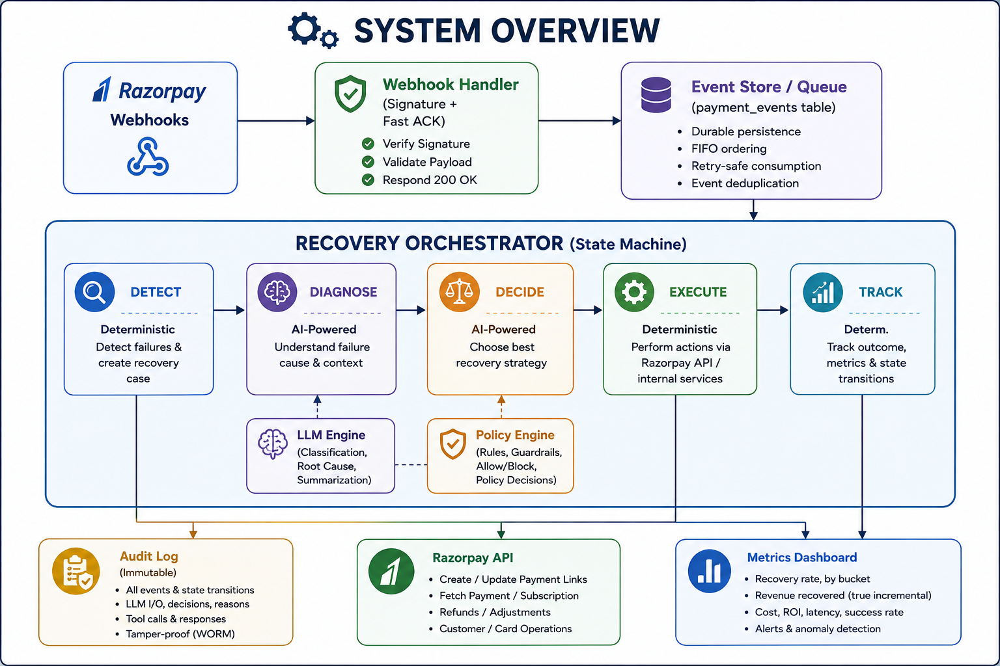
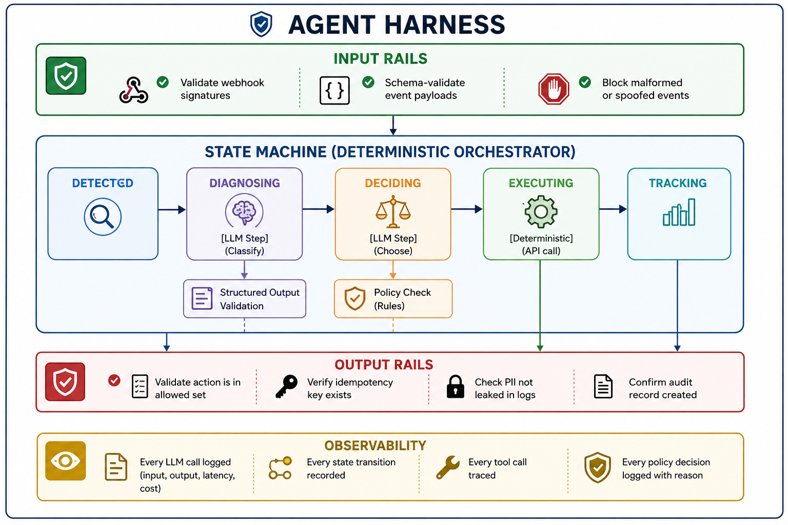
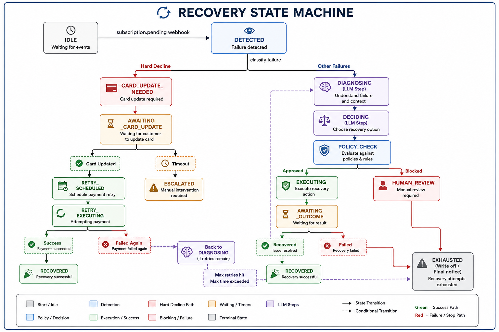
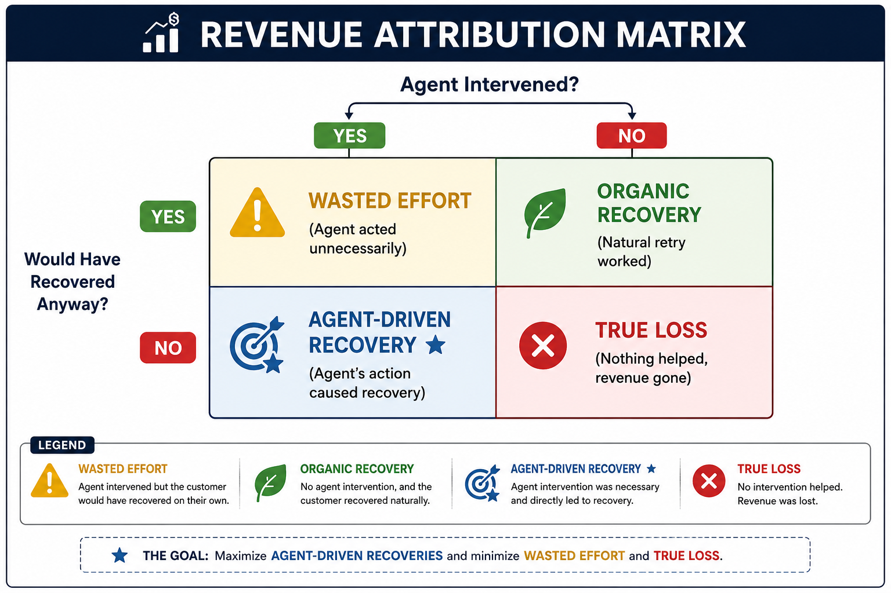
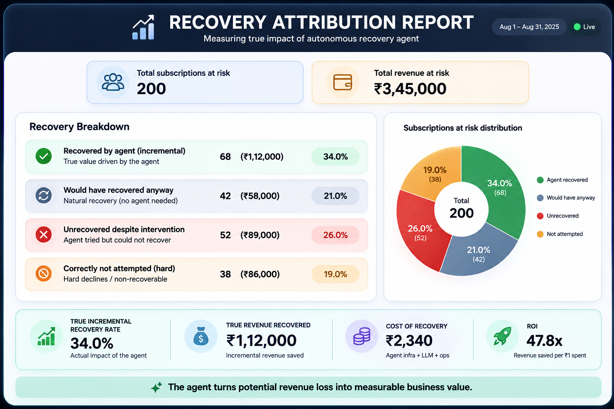

# AI Revenue Recovery: Complete Hackathon Preparation Guide

> **Purpose:** Teach you to think like a fintech engineer + AI agent architect so you can design and build this yourself.
> **Track:** AI Revenue Recovery — "Find revenue that's slipping away and win it back"

---

## Table of Contents

1. [The Business Problem](#1-the-business-problem)
2. [Problem Comparison &amp; Selection](#2-problem-comparison--selection)
3. [System Design from First Principles](#3-system-design-from-first-principles)
4. [Agent Architecture Deep Dive](#4-agent-architecture-deep-dive)
5. [Harness Engineering](#5-harness-engineering)
6. [Data &amp; Evaluation](#6-data--evaluation)
7. [Proving Revenue Recovery](#7-proving-revenue-recovery)
8. [Failure Handling](#8-failure-handling)
9. [Security &amp; Compliance](#9-security--compliance)
10. [Razorpay Integration](#10-razorpay-integration)
11. [Architecture Alternatives](#11-architecture-alternatives)
12. [Learning Roadmap](#12-learning-roadmap)
13. [Conceptual Design Proposal](#13-conceptual-design-proposal)
14. [Hackathon Strategy](#14-hackathon-strategy)
15. [Final Action Items](#15-final-action-items)

---

## 1. The Business Problem

### 1.1 Where Exactly Does Merchant Revenue Leak?

Revenue leakage is not a single failure — it's a taxonomy of losses across the payment lifecycle:

```
                     MERCHANT REVENUE LEAKAGE MAP
┌─────────────────┬──────────────────┬──────────────────┬─────────────────┐
│  Payment-Level  │  Checkout/Funnel │  Billing/Usage   │  Mandate &      │
│  Failures       │  Abandonment     │  Discrepancies   │  Regulatory     │
├─────────────────┼──────────────────┼──────────────────┼─────────────────┤
│ Insufficient    │ 70% avg cart     │ Dropped usage    │ e-Mandate reg   │
│   funds (40%+)  │   drop-off       │   events         │   drop-off      │
│ Expired cards   │ Hidden costs     │ CRM-billing      │ Pre-debit alert │
│ Soft declines   │   cause 48%      │   sync gaps      │   failures      │
│ Hard declines   │ Forced signup    │ Unmetered        │ Card reissuance │
│ Processor       │   causes 26%     │   add-ons        │   breaks        │
│   outages       │ Missing local    │ Unapplied rate   │ AFA/OTP         │
│                 │   payment methods│   changes        │   friction      │
└─────────────────┴──────────────────┴──────────────────┴─────────────────┘
```

**Key statistics** (from industry research):

- **7–12%** of MRR enters a failed state every billing cycle ([Recurly, Baremetrics benchmarks](https://recurly.com/research/churn-rate-benchmarks/))
- **70.19%** average checkout abandonment rate ([Baymard Institute](https://baymard.com/lists/cart-abandonment-rate))
- **20–40%** of SaaS churn is *involuntary* (payment failure, not customer choice)
- **~40%** of cards are reissued annually (expiration, fraud, bank portfolio changes)
- **57%** of B2B invoices are paid past due dates

### 1.2 What Signals Tell Us Revenue Is at Risk?

Signals exist *before* a payment fails. Understanding these is what separates a reactive system from a proactive one:

| Signal Category                 | Examples                                                                          | Lead Time     |
| :------------------------------ | :-------------------------------------------------------------------------------- | :------------ |
| **Payment degradation**   | Shift from T+0 to T+15 payment, consecutive soft declines, increasing retry count | Days to weeks |
| **Credential decay**      | Card approaching expiration, no Account Updater match, token invalidation         | Weeks         |
| **Behavioral shifts**     | Login frequency drops, reduced API/seat usage, billing dispute tickets            | Weeks         |
| **Financial stress**      | Switch from corporate card to prepaid, downgrades, partial payments               | Days          |
| **Communication signals** | Unopened dunning emails, no response to SMS, customer complaint history           | Hours to days |

### 1.3 The Nine Questions Answered

**Q3: Which revenue-recovery problem is best for a hackathon?**

**Failed subscription recovery.** I'll justify this fully in Section 2, but the short version: it has the clearest state machine, the most measurable outcomes, excellent Razorpay API support, and the strongest agentic potential.

**Q4: Why is this problem difficult enough to justify an AI agent?**

Because the *optimal recovery strategy varies per customer and per failure reason*. A simple retry-every-3-days approach recovers ~30%. Getting to 70%+ requires:

- Classifying failure reasons (soft vs. hard decline, temporary vs. permanent)
- Choosing the right intervention (silent retry vs. email vs. SMS vs. payment link)
- Timing the retry optimally (payday alignment, time-of-day)
- Personalizing communication (tone, urgency, channel preference)
- Knowing when to stop (diminishing returns, compliance limits)

No fixed rule engine can handle all these dimensions well. But a *fully autonomous* LLM can't be trusted with money. This tension is what makes it a perfect agentic problem.

**Q5: Which parts should be handled by AI?**

| AI Should Handle               | Why                                                             |
| :----------------------------- | :-------------------------------------------------------------- |
| Failure root cause diagnosis   | Requires reasoning across error codes, history, and patterns    |
| Customer segmentation          | Requires weighing multiple behavioral signals                   |
| Intervention selection         | Requires balancing multiple factors (cost, likelihood, channel) |
| Communication content          | Personalization, tone, language adaptation                      |
| Recovery timing recommendation | Pattern recognition across historical data                      |

**Q6: Which parts should remain deterministic?**

| Deterministic                                 | Why                                              |
| :-------------------------------------------- | :----------------------------------------------- |
| Payment state machine transitions             | Money movement must be auditable and predictable |
| Retry execution (the actual API call)         | Must be idempotent, signed, authorized           |
| Policy enforcement (max retries, time limits) | Hard rules must never be overridden by LLM       |
| Stopping rules                                | Legal/compliance — cannot be probabilistic      |
| Audit logging                                 | Every action must be immutably recorded          |
| Amount calculations                           | Financial math must be exact, not approximated   |

**Q7: Where should human approval exist?**

- Before any action exceeding a monetary threshold (e.g., waiving fees > ₹500)
- Before escalating to phone/voice outreach
- Before writing off a receivable
- When the agent's confidence is below a threshold
- When the agent encounters an unrecognized failure pattern
- Before any action that could be perceived as aggressive collection

**Q8: What financial actions should never be left directly to an LLM?**

> [!CAUTION]
> **Never let an LLM directly:**
>
> - Execute a payment charge or refund
> - Modify a subscription amount
> - Create or cancel a mandate
> - Waive or adjust invoice amounts
> - Access raw card numbers or PII
> - Choose to contact a customer without policy checks
> - Decide to stop trying without checking stopping rules

The LLM should *recommend* actions. Deterministic code should *validate and execute* them.

**Q9: What would make this genuinely "agentic" rather than just an LLM calling APIs?**

A system is genuinely agentic when the LLM:

1. **Reasons about context** — not just executing a fixed workflow
2. **Makes decisions between multiple valid options** — choosing email vs. SMS vs. payment link based on customer history
3. **Adapts its plan** — if the first intervention fails, it re-evaluates rather than blindly following a script
4. **Operates within a feedback loop** — observes the outcome of its actions and adjusts
5. **Handles novel situations** — encounters a failure pattern it hasn't seen and reasons about what to do

The key distinction: **an automation pipeline follows a fixed path. An agent reasons about which path to take, within bounded constraints.**

---

## 2. Problem Comparison & Selection

### Evaluation Matrix

| Criterion                           | Failed Payment Recovery | Checkout Abandonment | Failed Subscription Recovery | B2B Overdue Receivables    | Mandate Retry Sequencing |
| :---------------------------------- | :---------------------- | :------------------- | :--------------------------- | :------------------------- | :----------------------- |
| **Business value**            | ★★★★☆              | ★★★★★           | ★★★★★                   | ★★★★☆                 | ★★★☆☆               |
| **Technical difficulty**      | ★★★☆☆              | ★★☆☆☆           | ★★★★☆                   | ★★★★★                 | ★★★☆☆               |
| **Data requirements**         | Moderate                | Simple (sessions)    | Moderate-High                | High (invoices, contracts) | High (mandate registry)  |
| **Synthetic data ease**       | ★★★★☆              | ★★★★★           | ★★★★★                   | ★★★☆☆                 | ★★☆☆☆               |
| **Measurable recovery**       | ★★★★★              | ★★★☆☆           | ★★★★★                   | ★★★★☆                 | ★★★☆☆               |
| **Agentic potential**         | ★★★☆☆              | ★★☆☆☆           | ★★★★★                   | ★★★★★                 | ★★☆☆☆               |
| **Razorpay API support**      | ★★★★☆              | ★★★☆☆           | ★★★★★                   | ★★★☆☆                 | ★★★☆☆               |
| **Risk/compliance**           | Medium                  | Low                  | Medium-High                  | High                       | High                     |
| **Demo quality**              | ★★★★☆              | ★★★☆☆           | ★★★★★                   | ★★★☆☆                 | ★★☆☆☆               |
| **Hackathon differentiation** | Low (many will try)     | Low (well-trodden)   | **High**               | Medium                     | High (but hard to demo)  |
| **MVP time**                  | 6-8 hours               | 4-6 hours            | 10-14 hours                  | 12-16 hours                | 10-14 hours              |
| **Risk of superficiality**    | High                    | Very High            | **Low**                | Medium                     | High                     |

### Per-Problem Analysis

**Failed Payment Recovery** — Simple to start, but hard to differentiate. Most teams will build "retry failed payments." Without the subscription context, you lose the recurring revenue angle that judges care about. Risk: looks like a cron job with an LLM slapped on.

**Checkout Abandonment** — Very well-studied, many existing tools (Klaviyo, CartStack). Hard to show *measured money recovered* because checkout doesn't have the recurring structure. Low agentic depth — most logic is just "send email at T+30min."

**Failed Subscription Recovery** (★ RECOMMENDED) — The sweet spot. Clear state machine (pending → halted → recovered/lost). Razorpay has a full Subscriptions API with webhooks for every state. Natural multi-step agent workflow: diagnose → decide → intervene → track → escalate. Revenue attribution is straightforward: subscription was failing, agent intervened, subscription is now active = ₹X/month recovered.

**B2B Overdue Receivables** — Genuinely agentic (negotiation, promise-to-pay tracking), but requires complex data (contracts, PO numbers, AP contacts). Hard to simulate realistically. Demo risk: B2B workflows are slow (days/weeks) and hard to compress.

**Mandate Retry Sequencing** — Technically interesting but narrow. Hard to demo compellingly. Requires deep understanding of eNACH/UPI AutoPay infrastructure that's hard to simulate.

### Recommendation

> [!IMPORTANT]
> **Build a Failed Subscription Recovery Agent.**
>
> Specifically: An agent that monitors `subscription.pending` and `subscription.halted` events from Razorpay, diagnoses the failure, selects the optimal recovery strategy per customer, executes a bounded recovery workflow, and measures revenue recovered.

Why this wins:

1. **Clear revenue attribution** — Subscription was churning, now it's active = ₹X/month saved
2. **Natural state machine** — Razorpay subscription states map directly to your recovery states
3. **Rich agentic decisions** — Timing, channel, message, escalation
4. **Testable in Razorpay test mode** — Full subscription lifecycle with webhooks
5. **Measurable batch evaluation** — Run against 1000 synthetic subscriptions, report aggregate recovery
6. **Compliance-relevant** — RBI e-mandate rules, pre-debit notifications, contact limits
7. **Demo-friendly** — Show live state transitions on a dashboard

---

## 3. System Design from First Principles

### 3.1 Conceptual Architecture Overview




### 3.2 Component Deep Dive

I'll walk through each component explaining *why it exists*, *what problem it solves*, *AI vs. deterministic*, *what can go wrong*, and *how to test it*.

---

#### Component 1: Webhook Handler (Input Events)

**Why it exists:** Razorpay communicates asynchronously. When a subscription charge fails, Razorpay sends a `subscription.pending` webhook. When all retries are exhausted, it sends `subscription.halted`. Your system needs to catch these events reliably.

**What problem it solves:** Converts external payment events into internal domain events your system can process.

**AI vs. Deterministic:** 100% deterministic. This is infrastructure code. No LLM involvement.

**What can go wrong:**

- Webhook arrives but your server is down → Razorpay retries with exponential backoff over 24 hours
- Duplicate webhooks arrive (Razorpay retries on non-2xx) → Need idempotent processing
- Webhook signature is invalid → Could be a spoofed request
- Webhook arrives out of order (halted before pending) → Need state guards

**How to test it:**

- Send test webhooks with invalid signatures → verify rejection
- Send the same webhook twice → verify only one event is processed
- Send out-of-order webhooks → verify state machine handles gracefully
- Simulate server downtime → verify Razorpay retries work

**Key implementation rules:**

```
1. Verify X-Razorpay-Signature (HMAC-SHA256) FIRST
2. Respond 200 OK immediately (< 5 seconds)
3. Persist raw event to database
4. Process asynchronously from the stored event
5. Deduplicate using event_id
```

---

#### Component 2: Event Store

**Why it exists:** Every state change must be recorded immutably for audit. You need the ability to replay events for testing and debugging.

**What problem it solves:** Audit trail + event replay + debugging production issues.

**AI vs. Deterministic:** 100% deterministic. Append-only data store.

**What can go wrong:**

- Events written without proper sequencing → corrupted state
- Events lost before processing → missed recovery opportunities

**How to test it:**

- Write N events, replay them, verify final state matches
- Corrupt an event, verify system detects the inconsistency

**Data model:**

```
payment_events:
  - event_id: UUID (PK)
  - aggregate_id: UUID (subscription_id / payment_id)
  - event_type: STRING (subscription.pending, retry.attempted, etc.)
  - sequence_number: INT (monotonic per aggregate)
  - payload: JSON (raw event data)
  - metadata: JSON (trace_id, actor, idempotency_key)
  - created_at: TIMESTAMP
```

---

#### Component 3: Revenue-at-Risk Detection (DETECT)

**Why it exists:** Not every failed payment needs the same urgency. Detection triages incoming events and identifies which represent real revenue at risk.

**What problem it solves:** Filters noise from signal. A soft decline on a ₹99 subscription needs different handling than a soft decline on a ₹9,999 subscription.

**AI vs. Deterministic:** Primarily deterministic, with optional AI enrichment.

- **Deterministic:** Parse error codes, check amount, check subscription tier
- **AI (optional):** Score the "risk level" based on customer history patterns

**What can go wrong:**

- False positives: flagging a transient glitch as revenue-at-risk
- False negatives: missing a genuinely at-risk subscription
- Threshold miscalibration: treating all failures equally

**How to test it:**

- Feed known soft-decline events → verify they're flagged
- Feed known hard-decline events → verify they're flagged differently
- Feed a successful payment → verify it's NOT flagged

---

#### Component 4: Failure Diagnosis (DIAGNOSE)

**Why it exists:** Different failure reasons require fundamentally different recovery strategies. "Insufficient funds" needs a timed retry. "Expired card" needs a payment update link. "Stolen card" needs immediate stop.

**What problem it solves:** Maps raw error codes + contextual data → actionable diagnosis.

**AI vs. Deterministic:** **Hybrid.** This is where the LLM adds genuine value.

- **Deterministic first:** Map Razorpay error codes to categories (see decline classification below)
- **AI enrichment:** When the error is ambiguous (e.g., `do_not_honor`), the LLM reasons about the customer's history to infer the likely root cause

**Decline Classification Matrix:**

| Error Reason                   | Category                 | Recoverable?          | Action                       |
| :----------------------------- | :----------------------- | :-------------------- | :--------------------------- |
| `insufficient_funds`         | Soft Decline             | Yes (timed retry)     | Wait for payday, then retry  |
| `gateway_timeout`            | Soft Decline (Technical) | Yes (immediate retry) | Retry in 1-4 hours           |
| `expired_card`               | Hard Decline (Data)      | Via card update       | Send payment update link     |
| `stolen_card`, `lost_card` | Hard Decline (Fraud)     | **No**          | Stop all retries immediately |
| `do_not_honor`               | Ambiguous                | Maybe                 | AI reasons about history     |
| `invalid_cvc`                | Hard Decline (Data)      | Via card update       | Send payment update link     |

**What can go wrong:**

- LLM misclassifies a hard decline as soft → wastes retries, risks card network penalties
- LLM hallucinates a non-existent error category → invalid recovery path
- Missing error code mapping → unhandled case

**How to test it:**

- Create a test set of 50 error codes with known correct diagnoses
- Measure classification accuracy
- Test edge cases: ambiguous codes, missing fields

---

#### Component 5: Customer Segmentation

**Why it exists:** A first-time subscriber on a free trial behaves differently from a 3-year enterprise customer. Recovery strategy must adapt.

**What problem it solves:** Personalizes the recovery approach to maximize success probability.

**AI vs. Deterministic:** **AI-powered.** This is a natural LLM task — synthesizing multiple signals into a customer profile.

**Segmentation dimensions:**

```
Customer → {
  value_tier: HIGH | MEDIUM | LOW,
  tenure: NEW | ESTABLISHED | LOYAL,
  payment_reliability: {
    historical_success_rate: 0.95,
    avg_retry_count: 1.2,
    previous_recovery_count: 2
  },
  communication_preference: {
    preferred_channel: EMAIL | SMS | WHATSAPP,
    response_history: [...],
    best_contact_time: "morning"
  },
  risk_profile: {
    churn_probability: 0.35,
    lifetime_value: 45000
  }
}
```

---

#### Component 6: Decision Making / Intervention Selection (DECIDE)

**Why it exists:** Given a diagnosis and customer profile, the system must choose the optimal recovery action from a menu of options.

**What problem it solves:** Replaces the "one-size-fits-all" retry with personalized interventions.

**AI vs. Deterministic:** **AI reasons, policy validates.**

The LLM proposes an intervention. The policy engine validates it.

```
LLM Output (Structured):
{
  "recommended_action": "send_payment_link",
  "channel": "whatsapp",
  "timing": "2024-01-15T09:00:00+05:30",
  "message_tone": "empathetic",
  "reasoning": "Customer has 95% historical payment rate, failure is 
                insufficient_funds, next payday is Jan 15. WhatsApp 
                preferred (100% open rate on previous messages).",
  "confidence": 0.82
}

Policy Engine Check:
✅ Action is in allowed_actions list
✅ Channel is in permitted_channels
✅ Timing is within allowed contact hours (8AM-7PM)
✅ Customer hasn't been contacted in last 24 hours
✅ Total contact count < max_contacts (6)
✅ Confidence > minimum_threshold (0.6)
→ APPROVED
```

**What can go wrong:**

- LLM recommends an action outside the allowed set → policy blocks it
- LLM recommends contacting at 3AM → policy blocks it
- LLM is overconfident and recommends aggressive action → confidence thresholds
- LLM picks the right action but wrong timing → payday logic

**How to test it:**

- Give the LLM 100 scenarios with known best actions (determined by domain experts)
- Measure how often it picks the right action
- Verify policy engine blocks all out-of-bounds recommendations

---

#### Component 7: Policy Engine

**Why it exists:** The LLM is probabilistic. Financial actions require deterministic guardrails. The policy engine is the "immune system" that prevents bad actions.

**What problem it solves:** Prevents the agent from violating business rules, compliance requirements, or contact limits — regardless of what the LLM recommends.

**AI vs. Deterministic:** 100% deterministic. This is a rule engine.

**Core policies (pseudocode):**

```python
# Stopping rules
assert retry_count < MAX_RETRIES  # e.g., 6
assert total_contacts < MAX_CONTACTS  # e.g., 4-6 over 21 days
assert days_since_first_failure < MAX_RECOVERY_WINDOW  # e.g., 21 days

# Contact rules
assert current_hour >= 8 and current_hour <= 19  # RBI guideline
assert hours_since_last_contact >= 24
assert customer_has_not_opted_out

# Financial rules  
assert action != "charge" or has_valid_idempotency_key
assert action != "waive_fee" or fee_amount < AUTO_WAIVE_LIMIT
assert action != "retry" or decline_type != "HARD_DECLINE"

# Compliance
assert customer_has_valid_consent
assert pre_debit_notification_sent  # RBI e-mandate requirement
```

**What can go wrong:**

- Missing a policy rule → allows a prohibited action
- Policy too strict → blocks legitimate recovery attempts
- Policy not updated when regulations change

**How to test it:**

- Write unit tests for every policy rule
- Create adversarial inputs (LLM recommends absurd actions) → verify they're all blocked
- Test boundary conditions (exactly at the limit)

---

#### Component 8: Action Execution (EXECUTE)

**Why it exists:** Converts approved decisions into actual actions — creating a payment link, sending an SMS, scheduling a retry.

**What problem it solves:** The "muscles" of the system. Everything before this was reasoning; this is doing.

**AI vs. Deterministic:** 100% deterministic. API calls must be exact, idempotent, and logged.

**Available actions:**

1. **Silent retry** — `POST /v1/payments` with idempotency key
2. **Send payment link** — `POST /v1/payment_links` via Razorpay
3. **Send dunning email/SMS** — via communication service
4. **Schedule delayed retry** — enqueue for future execution
5. **Escalate to human** — create task in review queue
6. **Mark as unrecoverable** — update status, stop workflow

**Idempotency pattern for every action:**

```
1. Generate idempotency key: f"recovery-{subscription_id}-{attempt_number}"
2. Check: has this exact action already been executed?
   - If yes: return cached result
   - If no: execute and store result
3. Log: action, result, timestamp, actor, idempotency_key
```

---

#### Component 9: Outcome Tracking & Revenue Attribution (TRACK)

**Why it exists:** The judges want to see: "This system recovered ₹X." You need to track what happened after each intervention.

**What problem it solves:** Closes the feedback loop and proves the system works.

**AI vs. Deterministic:** 100% deterministic. Accounting must be exact.

**Tracking data model:**

```
recovery_case:
  - case_id: UUID
  - subscription_id: UUID
  - customer_id: UUID
  - revenue_at_risk: DECIMAL (monthly subscription amount)
  - failure_reason: STRING
  - diagnosis: STRING
  - interventions: [
      {
        action: "silent_retry",
        timestamp: ...,
        result: "failed",
        cost: 0
      },
      {
        action: "send_payment_link",
        channel: "whatsapp",
        timestamp: ...,
        result: "payment_received",
        cost: 0.50  // SMS cost
      }
    ]
  - final_outcome: RECOVERED | LOST | ESCALATED
  - recovery_amount: DECIMAL
  - time_to_recovery: DURATION
  - attribution: AGENT | ORGANIC | UNKNOWN
```

---

## 4. Agent Architecture Deep Dive

### 4.1 The Fundamental Design Choice

There is a spectrum of approaches. Understanding where to position your system is the single most important architectural decision:

```
 AUTONOMY SPECTRUM (for fintech recovery)

 Level 1              Level 2              Level 3              Level 4
 Fixed Pipeline       Router + Rules       State Machine +      Autonomous
 (Cron + if/else)     (LLM classifies,     LLM Reasoning        Agent Loop
                       code handles)       (RECOMMENDED)        (Dangerous)

 "Retry every 3       "LLM picks the       "State machine       "LLM decides
  days, send email     action from a        controls flow,       everything:
  on day 7"            fixed menu,          LLM reasons at       when, what,
                       policy validates"     each decision        how, and
                                            point"               whether
                                                                 to stop"
 ─────────────────────────────────────────────────────────────────────────▶
 More predictable                                        More flexible
 Less impressive                                         More dangerous
 Easier to build                                         Harder to trust
```

> [!IMPORTANT]
> **Recommended: Level 3 — Deterministic State Machine + LLM Reasoning at Decision Points**
>
> The state machine controls *flow* (what happens next, when to stop, what's allowed).
> The LLM controls *reasoning* (which specific action, what message, what timing).
>
> This is what Martin Fowler calls "Agent = Model + Harness" ([martinfowler.com](https://martinfowler.com/articles/exploring-gen-ai.html)).
> Anthropic calls it "workflows over autonomous agents" for production systems ([anthropic.com/research/building-effective-agents](https://www.anthropic.com/research/building-effective-agents)).

### 4.2 The Harness Architecture



### 4.3 The Recovery State Machine

This is the heart of the system. Every subscription recovery case moves through these states:




### 4.4 Structured Outputs: How the LLM Communicates

The LLM should never return free-form text for decisions. Use structured outputs:

```python
# Using Pydantic for structured LLM output (with instructor library)
from pydantic import BaseModel, Field
from enum import Enum

class DeclineCategory(str, Enum):
    SOFT_DECLINE_FUNDS = "insufficient_funds"
    SOFT_DECLINE_TECHNICAL = "technical_error"
    HARD_DECLINE_CARD = "card_invalid"
    HARD_DECLINE_FRAUD = "fraud_block"
    AMBIGUOUS = "ambiguous"

class RecoveryChannel(str, Enum):
    SILENT_RETRY = "silent_retry"
    EMAIL = "email"
    SMS = "sms"
    WHATSAPP = "whatsapp"
    PAYMENT_LINK = "payment_link"

class FailureDiagnosis(BaseModel):
    """Structured diagnosis of a subscription payment failure."""
    category: DeclineCategory
    root_cause: str = Field(description="1-sentence explanation of the root cause")
    recoverable: bool
    confidence: float = Field(ge=0.0, le=1.0)
    reasoning: str = Field(description="Step-by-step reasoning for this diagnosis")

class RecoveryRecommendation(BaseModel):
    """Structured recommendation for a recovery action."""
    action: RecoveryChannel
    delay_hours: int = Field(ge=0, le=504, description="Hours to wait before executing")
    message_tone: str = Field(description="e.g., empathetic, urgent, formal")
    reasoning: str
    confidence: float = Field(ge=0.0, le=1.0)
    fallback_action: RecoveryChannel | None = None
```

This is critical because:

1. **Parseable** — Your code can process the output deterministically
2. **Validatable** — Pydantic catches invalid values immediately
3. **Testable** — You can compare against expected outputs
4. **Auditable** — The `reasoning` field explains every decision

### 4.5 What Framework to Use

For a hackathon, you want something that gives you state machine + LLM integration without heavy infrastructure.

| Option                                      | Pros                                               | Cons                                 | Recommendation                            |
| :------------------------------------------ | :------------------------------------------------- | :----------------------------------- | :---------------------------------------- |
| **LangGraph**                         | Native state machines, checkpointing, HITL, Python | Learning curve, LangChain dependency | ★★★★★ Best for this project          |
| **Temporal + LLM calls**              | Industrial-grade durability, saga support          | Heavy infra, overkill for hackathon  | ★★★☆☆ Too much setup time            |
| **Inngest**                           | Serverless, great dev UI, step functions           | Less state machine flexibility       | ★★★★☆ Good alternative               |
| **Custom Python + state machine lib** | Full control, lightweight                          | More boilerplate                     | ★★★☆☆ Viable if you know Python well |

> **My recommendation: LangGraph** — It gives you state machines, conditional edges, checkpointing (for HITL), and built-in tool calling. The learning investment pays off quickly for this use case.

---

## 5. Harness Engineering

This section translates the abstract concept of "agent harness" into practical implementation guidance for your recovery agent.

### 5.1 Tool Boundaries

Define exactly what tools your agent can call, and what each tool is authorized to do:

```python
# Tool permission tiers
TOOLS = {
    # Tier 0: Read-only, always allowed
    "get_subscription_details": {
        "tier": 0,
        "description": "Fetch subscription info from Razorpay",
        "side_effects": False,
    },
    "get_customer_history": {
        "tier": 0,
        "description": "Fetch customer payment history",
        "side_effects": False,
    },
  
    # Tier 1: State-changing, auto-approved with policy check
    "create_payment_link": {
        "tier": 1,
        "description": "Create a Razorpay payment link for card update",
        "side_effects": True,
        "requires_idempotency_key": True,
        "max_amount": 100000,  # ₹1000 in paise
    },
    "send_notification": {
        "tier": 1,
        "description": "Send recovery notification via email/SMS",
        "side_effects": True,
        "requires_contact_policy_check": True,
    },
    "schedule_retry": {
        "tier": 1,
        "description": "Schedule a payment retry at a future time",
        "side_effects": True,
        "requires_idempotency_key": True,
    },
  
    # Tier 2: High-impact, requires human approval
    "cancel_subscription": {
        "tier": 2,
        "description": "Cancel the subscription (write off)",
        "side_effects": True,
        "requires_human_approval": True,
    },
    "waive_charges": {
        "tier": 2,
        "description": "Waive overdue charges",
        "side_effects": True,
        "requires_human_approval": True,
    },
}
```

### 5.2 Invariants & Assertions

These are properties that must ALWAYS be true, checked before and after every action:

```python
# Pre-conditions (checked BEFORE executing any action)
def pre_check(case, action):
    assert case.status != "RECOVERED", "Cannot act on already-recovered case"
    assert case.status != "EXHAUSTED", "Cannot act on exhausted case"
    assert case.retry_count <= MAX_RETRIES, "Retry limit exceeded"
    assert case.contact_count <= MAX_CONTACTS, "Contact limit exceeded"
    assert not case.customer_opted_out, "Customer opted out of communications"
  
    if action.type == "retry":
        assert case.decline_category != "HARD_DECLINE_FRAUD", "Cannot retry fraud declines"
        assert action.idempotency_key is not None, "Retry requires idempotency key"
  
    if action.type in ["send_notification", "create_payment_link"]:
        now = datetime.now(case.customer_timezone)
        assert 8 <= now.hour <= 19, "Contact outside permitted hours"

# Post-conditions (checked AFTER executing any action)
def post_check(case, action, result):
    assert case.audit_log[-1].action == action.type, "Audit log must record action"
    assert case.audit_log[-1].timestamp is not None, "Audit must have timestamp"
    assert case.total_amount_charged <= case.subscription_amount, "Cannot overcharge"
```

### 5.3 Deterministic Validation of LLM Outputs

Every LLM output goes through a validation pipeline:

```
LLM Output → Schema Validation → Business Rule Check → Policy Engine → Approved/Rejected
```

```python
def validate_llm_recommendation(rec: RecoveryRecommendation, case: RecoveryCase) -> bool:
    # 1. Schema validation (handled by Pydantic automatically)
  
    # 2. Business rule checks
    if rec.action == "silent_retry" and case.decline_category == "HARD_DECLINE_FRAUD":
        return False, "Cannot retry fraud declines"
  
    if rec.delay_hours == 0 and case.last_action_time and \
       (now() - case.last_action_time).hours < 4:
        return False, "Minimum 4-hour gap between actions"
  
    # 3. Policy engine
    if rec.action in ["email", "sms", "whatsapp"]:
        if case.contact_count >= MAX_CONTACTS:
            return False, "Contact limit reached"
  
    # 4. Confidence threshold
    if rec.confidence < MIN_CONFIDENCE:
        return False, "Confidence below threshold — escalate to human"
  
    return True, "Approved"
```

### 5.4 Replayability

Design your system so every recovery case can be replayed deterministically:

```python
# Every recovery case stores its complete event stream
case_events = [
    {"type": "webhook_received", "payload": {...}, "ts": "..."},
    {"type": "diagnosis_completed", "input": {...}, "output": {...}, "ts": "..."},
    {"type": "recommendation_generated", "input": {...}, "output": {...}, "ts": "..."},
    {"type": "policy_check_passed", "rule_results": {...}, "ts": "..."},
    {"type": "action_executed", "action": "payment_link", "result": {...}, "ts": "..."},
    {"type": "outcome_received", "status": "recovered", "amount": 999, "ts": "..."},
]

# Replay function for testing
def replay_case(events, mock_llm_responses=None):
    """Replay a recovery case with optional mocked LLM responses."""
    state = initial_state()
    for event in events:
        if event["type"] == "diagnosis_completed" and mock_llm_responses:
            # Use mocked response instead of calling LLM
            state = apply_diagnosis(state, mock_llm_responses.pop(0))
        else:
            state = apply_event(state, event)
    return state
```

---

## 6. Data & Evaluation

### 6.1 Synthetic Dataset Design

The key to realistic synthetic data is **realistic distributions, not random values**.

**Customer generation strategy:**

```python
# DO NOT do this:
customer_id = random.uuid()
amount = random.randint(100, 10000)  # This is useless

# DO this — use realistic distributions:
import numpy as np

def generate_customers(n=1000):
    customers = []
    for i in range(n):
        # Subscription tier follows a power law (many cheap, few expensive)
        tier = np.random.choice(
            ["basic", "pro", "enterprise"],
            p=[0.60, 0.30, 0.10]
        )
        amount = {
            "basic": int(np.random.normal(499, 100)),      # ₹499 ± ₹100
            "pro": int(np.random.normal(1999, 300)),         # ₹1999 ± ₹300
            "enterprise": int(np.random.normal(9999, 2000)), # ₹9999 ± ₹2000
        }[tier]
  
        # Tenure correlates with payment reliability
        tenure_months = max(1, int(np.random.exponential(12)))
        reliability = min(0.99, 0.7 + (tenure_months * 0.02) + np.random.normal(0, 0.05))
  
        # Payment method quality
        payment_method = np.random.choice(
            ["credit_card", "debit_card", "upi_autopay", "emandate"],
            p=[0.35, 0.30, 0.25, 0.10]
        )
  
        customers.append({
            "customer_id": f"cust_{i:04d}",
            "tier": tier,
            "monthly_amount": max(99, amount),
            "tenure_months": tenure_months,
            "payment_reliability": round(reliability, 3),
            "payment_method": payment_method,
            "preferred_channel": np.random.choice(
                ["email", "sms", "whatsapp"],
                p=[0.30, 0.25, 0.45]  # WhatsApp dominant in India
            ),
            "timezone": "Asia/Kolkata",
        })
    return customers
```

**Failure event generation:**

```python
def generate_failure_events(customers, n_failures=200):
    events = []
    for _ in range(n_failures):
        customer = np.random.choice(customers)
  
        # Failure reason distribution (matches real-world)
        reason = np.random.choice(
            ["insufficient_funds", "expired_card", "gateway_timeout",
             "do_not_honor", "invalid_cvc", "stolen_card", 
             "network_error", "bank_unavailable"],
            p=[0.35, 0.15, 0.12, 0.15, 0.05, 0.03, 0.10, 0.05]
        )
  
        # Recoverability correlates with failure reason
        ground_truth_recoverable = reason in [
            "insufficient_funds", "gateway_timeout", 
            "do_not_honor", "network_error", "bank_unavailable"
        ]
  
        # Will this customer actually recover? (for evaluation)
        if ground_truth_recoverable:
            # Higher-reliability customers are more likely to recover
            recovery_probability = customer["payment_reliability"] * 0.8
            if reason == "insufficient_funds":
                recovery_probability *= 0.9  # Most recover
            elif reason == "do_not_honor":
                recovery_probability *= 0.5  # Lower chance
        else:
            recovery_probability = 0.15  # Card update might save some
  
        will_recover = np.random.random() < recovery_probability
  
        # Best intervention (ground truth for evaluation)
        if reason == "insufficient_funds":
            best_action = "silent_retry"
            best_delay = np.random.choice([24, 48, 72, 168])  # Hours to payday
        elif reason in ["expired_card", "invalid_cvc"]:
            best_action = "payment_link"
            best_delay = 0
        elif reason in ["gateway_timeout", "network_error", "bank_unavailable"]:
            best_action = "silent_retry"
            best_delay = np.random.choice([1, 4, 12])
        elif reason == "stolen_card":
            best_action = "stop"  # Do not retry
            best_delay = 0
        else:
            best_action = np.random.choice(["silent_retry", "payment_link"])
            best_delay = 24
    
        events.append({
            "event_id": f"evt_{len(events):04d}",
            "subscription_id": f"sub_{customer['customer_id']}",
            "customer_id": customer["customer_id"],
            "failure_reason": reason,
            "amount": customer["monthly_amount"] * 100,  # In paise
            "timestamp": generate_realistic_timestamp(),
            "error_code": map_to_razorpay_error(reason),
            # Hidden ground truth (for evaluation only)
            "_ground_truth": {
                "recoverable": ground_truth_recoverable,
                "will_recover_with_intervention": will_recover,
                "best_action": best_action,
                "best_delay_hours": best_delay,
                "recovery_probability": round(recovery_probability, 3),
            }
        })
    return events
```

### 6.2 Evaluation Metrics

#### Metric Definitions

| Metric                             | Formula                                                                    | What it Measures       |
| :--------------------------------- | :------------------------------------------------------------------------- | :--------------------- |
| **Revenue at Risk (₹)**     | `SUM(monthly_amount for all failed subscriptions)`                       | Total exposure         |
| **Recovery Rate**            | `recovered_cases / total_cases`                                          | Overall effectiveness  |
| **Revenue Recovered (₹)**   | `SUM(monthly_amount for recovered subscriptions)`                        | Bottom-line impact     |
| **Intervention Precision**   | `correct_action_chosen / total_actions`                                  | Agent decision quality |
| **False Positive Rate**      | `unnecessary_contacts / total_contacts`                                  | Customer annoyance     |
| **Unnecessary Outreach**     | `contacts_to_customers_who_would_have_recovered_anyway / total_contacts` | Waste of effort        |
| **Retry Success Rate**       | `successful_retries / total_retries`                                     | Retry strategy quality |
| **Avg Recovery Time**        | `mean(time_from_failure_to_recovery)`                                    | Speed of recovery      |
| **Cost Per Recovered Rupee** | `total_recovery_cost / total_revenue_recovered`                          | Efficiency             |
| **Escalation Rate**          | `escalated_to_human / total_cases`                                       | Autonomy level         |
| **Agent Success Rate**       | `(recovered_by_agent - would_have_recovered_anyway) / total_cases`       | True agent impact      |

#### Calculating Each Metric

```python
def calculate_metrics(results: list[RecoveryResult]) -> dict:
    total_cases = len(results)
    recovered = [r for r in results if r.outcome == "RECOVERED"]
    lost = [r for r in results if r.outcome == "LOST"]
    escalated = [r for r in results if r.outcome == "ESCALATED"]
  
    revenue_at_risk = sum(r.monthly_amount for r in results)
    revenue_recovered = sum(r.monthly_amount for r in recovered)
  
    # Cost calculation
    total_cost = sum(
        sum(a.cost for a in r.interventions) 
        for r in results
    )
  
    # Precision: did the agent choose the right first action?
    correct_actions = sum(
        1 for r in results 
        if r.interventions[0].action == r.ground_truth.best_action
    )
  
    return {
        "revenue_at_risk": revenue_at_risk,
        "revenue_recovered": revenue_recovered,
        "recovery_rate": len(recovered) / total_cases,
        "intervention_precision": correct_actions / total_cases,
        "avg_recovery_time_hours": mean(r.time_to_recovery for r in recovered),
        "cost_per_recovered_rupee": total_cost / revenue_recovered if revenue_recovered > 0 else float('inf'),
        "escalation_rate": len(escalated) / total_cases,
        "false_positive_rate": ...,  # See attribution section
    }
```

---

## 7. Proving Revenue Recovery

### 7.1 The Attribution Problem

The hardest question: **"Would this revenue have been recovered anyway, even without the agent?"**

This matters because Razorpay itself retries failed subscription payments. If your agent claims credit for a recovery that Razorpay would have handled automatically, your metrics are inflated.

### 7.2 The Four Buckets

Every recovery case falls into one of four buckets:




**Only the ★ AGENT-DRIVEN RECOVERY bucket represents genuine value.**

### 7.3 Experimental Setup for a Hackathon

You can't run a true A/B test in a hackathon. But you CAN create a **simulated control group** in your synthetic data:

```python
def run_evaluation(failure_events, agent):
    """Evaluate agent against a synthetic dataset with ground truth."""
  
    results = {"agent_recovered": [], "organic_would_recover": [], 
               "agent_failed": [], "organic_would_fail": []}
  
    for event in failure_events:
        # Run agent
        agent_result = agent.process(event)
  
        # Compare with ground truth
        would_recover_without_agent = event["_ground_truth"]["will_recover_with_intervention"]
        organic_recovery_rate = 0.30  # Baseline: Razorpay auto-retry recovers ~30%
        would_recover_organically = random.random() < organic_recovery_rate
  
        if agent_result.outcome == "RECOVERED":
            if would_recover_organically:
                results["organic_would_recover"].append(event)  # Wasted effort
            else:
                results["agent_recovered"].append(event)  # True agent value ★
        else:
            if would_recover_organically:
                results["organic_would_fail"].append(event)  # Agent failed but organic would too
            else:
                results["agent_failed"].append(event)  # True loss
  
    # The metric that matters
    incremental_recovery = len(results["agent_recovered"])
    incremental_revenue = sum(e["amount"] for e in results["agent_recovered"]) / 100
  
    print(f"Total revenue at risk: ₹{total_at_risk}")
    print(f"Agent-driven recovery (incremental): ₹{incremental_revenue}")
    print(f"Would have recovered anyway: ₹{organic_revenue}")
    print(f"True recovery rate: {incremental_recovery / len(failure_events):.1%}")
    print(f"Inflated rate (if you count organic): {(incremental_recovery + organic) / len(failure_events):.1%}")
```

### 7.4 Honest Reporting

Show this to judges — it demonstrates you understand attribution:




> [!TIP]
> Judges will be *much* more impressed by honest ₹1.12L with proper attribution than inflated ₹1.70L without it. The attribution analysis itself is a "wow moment."

---

## 8. Failure Handling

### 8.1 Failure Mode Catalog

| Failure Mode                                                | Impact                                                             | Correct Pattern                                                                                                                                                 |
| :---------------------------------------------------------- | :----------------------------------------------------------------- | :-------------------------------------------------------------------------------------------------------------------------------------------------------------- |
| **Payment succeeds but webhook delayed**              | System retries a payment that already worked → double charge risk | **Always check current payment status via API before retrying.** Never trust your local state alone.                                                      |
| **Payment status is ambiguous**                       | System doesn't know if payment went through → stuck state         | **Reconciliation polling:** Call `GET /v1/payments/{id}` to get the authoritative status. If truly ambiguous, wait and recheck (don't retry).           |
| **Retry triggered twice**                             | Duplicate payment charge                                           | **Idempotency keys.** Every retry uses a deterministic key: `recovery-{sub_id}-{attempt_n}`. Second call returns cached result.                         |
| **Duplicate charge risk**                             | Customer charged twice for same subscription period                | **Pre-execution check:** Query Razorpay for the subscription's current invoice status before attempting charge.                                           |
| **Customer pays manually while automated retry runs** | Both succeed → overpayment                                        | **Event-driven state update:** Listen for `subscription.charged` webhook. If received while retry is pending, cancel the retry.                         |
| **Agent recommends invalid action**                   | Attempted action that violates business rules                      | **Policy engine validation.** Every recommendation passes through rule checks before execution.                                                           |
| **Customer already contacted**                        | Duplicate outreach → customer annoyance                           | **Contact log check.** Before any communication, verify `last_contact_time` and `contact_count`.                                                      |
| **Recovery action keeps failing**                     | Infinite loop of failed retries                                    | **Circuit breaker + max retry count.** After N failures of the same action, escalate or stop.                                                             |
| **API timeout**                                       | Unknown state — did the action execute?                           | **Timeout ≠ failure.** Check result via polling. Use idempotency key so retry is safe even if first call succeeded.                                      |
| **Downstream API outage**                             | All recovery actions fail for all customers simultaneously         | **Circuit breaker pattern.** After 5 failures in 60 seconds, trip the breaker. Queue actions for later. Exponential backoff with full jitter for retries. |
| **LLM returns malformed output**                      | Application crashes or makes wrong decision                        | **Structured outputs + Pydantic validation + retry with error feedback.** If output is invalid after 3 attempts, use deterministic fallback.              |
| **LLM chooses action outside policy**                 | Unauthorized action could execute                                  | **Allowlist enforcement.** Action must be in the `ALLOWED_ACTIONS` set. Policy engine has veto power.                                                   |
| **Data is inconsistent**                              | Customer record says active, Razorpay says halted                  | **Razorpay is the source of truth.** Always fetch fresh state from Razorpay API before critical decisions.                                                |

### 8.2 The Idempotency Pattern (Critical)

```
Every payment action MUST follow this pattern:

1. Generate key: idempotency_key = f"recovery-{subscription_id}-attempt-{n}"
2. Check local store: has this key been executed before?
   → YES, status=COMPLETED: return cached result (DO NOT re-execute)
   → YES, status=IN_FLIGHT: return 409 Conflict (another process is handling it)
   → NO: proceed to step 3
3. Write to store: {key, status: IN_FLIGHT, timestamp}
4. Execute action against Razorpay API (include idempotency key in header)
5. On success: update store {status: COMPLETED, response: ...}
   On failure: delete store entry (so it can be retried)
6. Return result
```

---

## 9. Security & Compliance

### 9.1 Practical Security Checklist

| Concern                        | Hackathon Implementation                                                             | Production Note                                        |
| :----------------------------- | :----------------------------------------------------------------------------------- | :----------------------------------------------------- |
| **Least privilege**      | LLM can only call defined tools with defined parameters                              | In production: separate service accounts per tool tier |
| **Secrets**              | Store Razorpay keys in env vars, never in code or logs                               | Use vault service in production                        |
| **PII**                  | Never pass full card numbers or bank details to LLM. Mask to last 4 digits           | Required for PCI-DSS compliance                        |
| **Payment data**         | LLM sees: amount, status, failure reason. Never sees: card number, CVV, bank account | PCI-DSS requires this segregation                      |
| **Authorization**        | Every Tier 1+ action checks policy engine before execution                           | In production: add RBAC                                |
| **Idempotency**          | Every payment API call uses an idempotency key                                       | Non-negotiable for financial systems                   |
| **Audit logs**           | Append-only log of every action, decision, and LLM output                            | Must be tamper-proof in production                     |
| **Consent**              | Check customer hasn't opted out before any communication                             | TRAI DLT compliance in India                           |
| **Communication limits** | Max 4-6 contacts over 21 days, only 8AM-7PM IST                                      | RBI fair practices guidelines                          |
| **Stopping rules**       | Hard-coded max retries, max time window, hard decline blocking                       | Must be deterministic, never LLM-controlled            |
| **Human approval**       | Queue for high-impact actions (cancellation, fee waiver)                             | Required for financial actions above threshold         |
| **Safe retries**         | Check current status before retrying; never retry hard fraud declines                | Visa/MC network rules — violations cause fines        |

### 9.2 RBI E-Mandate Compliance (India-Specific)

> [!WARNING]
> **These are real regulatory requirements. Verify with the [official RBI circular](https://rbi.org.in) before production use.**

Key rules from the RBI Digital Payments E-Mandate Framework (Consolidated 2026):

| Rule                             | Requirement                                                           | Your System Must                                     |
| :------------------------------- | :-------------------------------------------------------------------- | :--------------------------------------------------- |
| **Pre-debit notification** | 24 hours before debiting customer                                     | Verify notification was sent before scheduling retry |
| **AFA-free limit**         | ≤ ₹15,000 per transaction for standard recurring                    | Check amount against threshold                       |
| **Customer control**       | Customer can modify/cancel mandate anytime, no fees                   | Respect opt-outs immediately                         |
| **Higher-value AFA**       | Insurance/MF/CC payments up to ₹1,00,000 without per-transaction AFA | Different limits for different categories            |

> [!CAUTION]
> **Claims that require legal verification:** The specific AFA thresholds, calling hour restrictions, and communication limits cited in this guide are based on public summaries. Always verify against the actual RBI circulars at [rbi.org.in](https://rbi.org.in) and consult legal counsel for production implementations.

---

## 10. Razorpay Integration

### 10.1 Relevant APIs (All from [razorpay.com/docs](https://razorpay.com/docs))

| Capability                    | Endpoint                           | Documentation                                                                                             |
| :---------------------------- | :--------------------------------- | :-------------------------------------------------------------------------------------------------------- |
| **Create Order**        | `POST /v1/orders`                | [razorpay.com/docs/api/orders/create/](https://razorpay.com/docs/api/orders/create/)                       |
| **Fetch Payment**       | `GET /v1/payments/{id}`          | [razorpay.com/docs/api/payments/](https://razorpay.com/docs/api/payments/)                                 |
| **Capture Payment**     | `POST /v1/payments/{id}/capture` | [razorpay.com/docs/api/payments/capture-payment/](https://razorpay.com/docs/api/payments/capture-payment/) |
| **Create Refund**       | `POST /v1/payments/{id}/refund`  | [razorpay.com/docs/api/refunds/create/](https://razorpay.com/docs/api/refunds/create/)                     |
| **Create Plan**         | `POST /v1/plans`                 | [razorpay.com/docs/api/subscriptions/](https://razorpay.com/docs/api/subscriptions/)                       |
| **Create Subscription** | `POST /v1/subscriptions`         | [razorpay.com/docs/api/subscriptions/](https://razorpay.com/docs/api/subscriptions/)                       |
| **Fetch Subscription**  | `GET /v1/subscriptions/{id}`     | [razorpay.com/docs/payments/subscriptions/](https://razorpay.com/docs/payments/subscriptions/)             |
| **Create Payment Link** | `POST /v1/payment_links`         | [razorpay.com/docs/api/payment-links/](https://razorpay.com/docs/api/payment-links/)                       |
| **Create Invoice**      | `POST /v1/invoices`              | [razorpay.com/docs/api/invoices/](https://razorpay.com/docs/api/invoices/)                                 |
| **Webhooks**            | Server-to-server`POST`           | [razorpay.com/docs/webhooks/](https://razorpay.com/docs/webhooks/)                                         |
| **Error Codes**         | Standard error response            | [razorpay.com/docs/api/errors/](https://razorpay.com/docs/api/errors/)                                     |
| **Test Card Numbers**   | Mock gateway                       | [razorpay.com/docs/payments/test-card-details/](https://razorpay.com/docs/payments/test-card-details/)     |

### 10.2 Subscription States (from Razorpay Docs)

```
[created] → [authenticated] → [active] → [completed]
     |              |               |
     v              v               v
  [expired]     [cancelled]     [pending] ← charge failed, dunning retries
                                    |
                                    v
                                 [halted] ← all retries exhausted
```

**Key webhook events for your system:**

- `subscription.pending` — Your trigger: a charge failed, recovery needed
- `subscription.halted` — All Razorpay retries exhausted, subscription suspended
- `subscription.charged` — Success: a retry worked
- `subscription.cancelled` — Subscription ended (don't try to recover)

### 10.3 What You Can Simulate in Test Mode

**Fully testable:**

- Create plans and subscriptions with test API keys (`rzp_test_...`)
- Process payments with test cards (Visa: `4384 7968 2770 3274`)
- Simulate payment failures using the "Failure" button on the mock bank page
- Receive webhooks (use [zrok](https://zrok.io/) for localhost tunneling — ngrok may be blacklisted)
- Create payment links
- Verify webhook signatures

**Cannot fully simulate:**

- Real bank retries (Razorpay's internal retry logic)
- Real SMS/email delivery (but you can mock this)
- Real-time card account updater responses
- Actual mandate registration flows

### 10.4 Integration Architecture for Demo

```
Your Local Server
┌─────────────────────────────────────────┐
│ POST /webhook/razorpay                  │ ← Razorpay sends webhooks here
│   → verify signature                   │    (via zrok tunnel)
│   → store event                        │
│   → trigger recovery workflow          │
│                                        │
│ Agent calls:                           │
│   → GET /v1/subscriptions/{id}         │ → Razorpay Test Mode API
│   → POST /v1/payment_links             │ → Razorpay Test Mode API
│   → (mock) send_sms/send_email         │ → Your mock notification service
└─────────────────────────────────────────┘
```

---

## 11. Architecture Alternatives

### Option A: Simple Hackathon Architecture

```
Webhook → Python Script → LLM Call → Action → Log
```

**Complexity:** Low
**Reliability:** Low (no state persistence, no retry safety)
**Implementation effort:** 4-6 hours
**Demo quality:** Low — looks like a script, not a product
**Extensibility:** Poor

**Verdict:** Skip this. It won't impress judges.

### Option B: Robust Event-Driven Architecture (★ RECOMMENDED)

```
Razorpay Webhooks
       │
       ▼
Webhook Handler (FastAPI/Flask)
       │
       ▼
Event Store (SQLite/Postgres)
       │
       ▼
Recovery Orchestrator (LangGraph State Machine)
   ├── Diagnosis Node (LLM + structured output)
   ├── Decision Node (LLM + policy engine)
   ├── Execution Node (Razorpay API calls)
   └── Tracking Node (metrics + audit)
       │
       ▼
Dashboard (Streamlit/React)
   ├── Live recovery cases
   ├── State machine visualization
   ├── Metrics dashboard
   └── Audit log viewer
```

**Complexity:** Medium
**Reliability:** High (state machine, idempotency, audit logs)
**Implementation effort:** 10-14 hours
**Demo quality:** High — shows live state transitions, real metrics
**Extensibility:** Good

**Verdict:** Best balance of impressiveness and feasibility.

### Option C: Highly Agentic Architecture

```
Multi-agent system with:
- Diagnosis Agent
- Strategy Agent  
- Communication Agent
- Monitoring Agent
- Supervisor Agent
```

**Complexity:** Very High
**Reliability:** Questionable (more agents = more failure modes)
**Implementation effort:** 16-20 hours
**Demo quality:** Impressive if it works, embarrassing if it doesn't
**Extensibility:** Excellent

**Verdict:** Too risky for a hackathon. Over-engineering. The state machine approach gives you the same "agentic" impression with much better reliability.

### Comparison Summary

| Criterion         | Option A (Simple) | Option B (Event-Driven) ★ | Option C (Multi-Agent)   |
| :---------------- | :---------------- | :------------------------- | :----------------------- |
| Build time        | 4-6h              | 10-14h                     | 16-20h                   |
| Reliability       | ★☆☆            | ★★★★☆                 | ★★☆☆☆               |
| Demo quality      | ★★☆            | ★★★★★                 | ★★★★☆ (if it works) |
| Risk of failure   | Low               | Low                        | High                     |
| Differentiation   | None              | High                       | Very High                |
| Scalability story | None              | Strong                     | Strong                   |

---

## 12. Learning Roadmap

### Stage 1: Revenue Recovery Fundamentals (2-3 hours)

**What to understand:** Why payments fail, what dunning is, how subscription billing works, what involuntary churn means.

**What to read:**

- [Stripe: Revenue Recovery](https://stripe.com/docs/billing/revenue-recovery) — The gold standard explanation
- [Stripe: Smart Retries Engineering Blog](https://stripe.com/blog/how-we-built-it-smart-retries) — How ML drives retry decisions
- [Baymard Institute: Cart Abandonment Statistics](https://baymard.com/lists/cart-abandonment-rate) — Industry benchmarks
- [Recurly: Churn Rate Benchmarks](https://recurly.com/research/churn-rate-benchmarks/) — SaaS churn data

**Why it matters:** You cannot build a recovery system without understanding what fails and why. Judges will ask.

**Exercise:** Write down the top 5 reasons payments fail in India and classify each as soft/hard decline.

### Stage 2: Payment Lifecycle (1-2 hours)

**What to understand:** How a payment moves from created → authorized → captured → settled → (possibly) refunded/disputed.

**What to read:**

- [Razorpay: Payment States](https://razorpay.com/docs/payments/payments/payment-states/) — Official lifecycle
- [Razorpay: Subscription Lifecycle](https://razorpay.com/docs/payments/subscriptions/lifecycle/states/) — Subscription state machine

**Why it matters:** Your state machine must respect the payment lifecycle. You can't retry a payment that's already captured.

**Exercise:** Draw the Razorpay subscription state machine by hand. Label every transition with the event that triggers it.

### Stage 3: Payment Failure Modes (1-2 hours)

**What to understand:** ISO decline codes, soft vs. hard declines, Visa/MC retry rules, card network penalties.

**What to read:**

- [Stripe: Decline Codes](https://stripe.com/docs/declines/codes) — Comprehensive list with meanings
- [Razorpay: Error Codes](https://razorpay.com/docs/api/errors/) — Razorpay error structure
- [AWS: Exponential Backoff and Jitter](https://aws.amazon.com/blogs/architecture/exponential-backoff-and-jitter/) — Retry math

**Why it matters:** Retrying a stolen card decline triggers network penalties. Your agent MUST classify declines correctly.

**Exercise:** Create a lookup table mapping Razorpay error reasons to recovery strategies.

### Stage 4: Retry & Dunning Systems (2-3 hours)

**What to understand:** How production dunning systems work, multi-stage recovery, channel selection, stopping rules.

**What to read:**

- [Stripe: Smart Retries](https://stripe.com/docs/billing/revenue-recovery/smart-retries) — ML-powered retry timing
- [Adyen: Auto Rescue](https://docs.adyen.com/online-payments/auto-rescue/) — Alternative approach

**Why it matters:** Directly relevant to your system design.

**Exercise:** Design a 4-stage dunning sequence (Silent retry → Email → SMS → Escalation) with specific timing.

### Stage 5: Event-Driven Architecture (2-3 hours)

**What to understand:** Event sourcing, webhooks, idempotency, exactly-once processing.

**What to read:**

- [Martin Fowler: Event Sourcing](https://martinfowler.com/eaaDev/EventSourcing.html)
- [Stripe: Idempotency](https://stripe.com/blog/idempotency) — Why and how
- [Brandur Leach: Idempotency Keys in Postgres](https://brandur.org/idempotency-keys) — Implementation details

**Why it matters:** Your webhook handler must be idempotent. Your event store must be append-only.

**Exercise:** Implement a simple webhook handler that verifies signatures, deduplicates events, and stores them.

### Stage 6: Agent Architecture (3-4 hours)

**What to understand:** Harness engineering, bounded autonomy, structured outputs, policy engines.

**What to read:**

- [Martin Fowler: Exploring Gen AI / Agent Harnesses](https://martinfowler.com/articles/exploring-gen-ai.html) — The foundational "Agent = Model + Harness" concept
- [Anthropic: Building Effective Agents](https://www.anthropic.com/research/building-effective-agents) — Workflows vs. autonomous agents
- [OpenAI: Structured Outputs](https://openai.com/index/introducing-structured-outputs-in-the-api/) — Schema-enforced outputs
- [Instructor Library](https://python.useinstructor.com/) — Pydantic-based structured LLM outputs

**Why it matters:** This is the core architectural insight that separates your project from "LLM wrapper."

**Exercise:** Write a Pydantic model for `FailureDiagnosis` and `RecoveryRecommendation`. Test it with instructor.

### Stage 7: Agent Harnesses & Guardrails (2 hours)

**What to read:**

- [NeMo Guardrails](https://github.com/NVIDIA/NeMo-Guardrails) — Programmable guardrails
- [Guardrails AI](https://docs.guardrailsai.com/) — Schema validation for LLM outputs

**Exercise:** Write the policy engine rules for your recovery agent (max retries, contact limits, hour restrictions).

### Stage 8: Evaluation (2 hours)

**What to understand:** How to measure agent performance, create evaluation datasets, calculate attribution.

**What to read:**

- [LangSmith Evaluation](https://docs.smith.langchain.com/concepts/evaluation) — Agent evaluation concepts
- Section 6 and 7 of this guide

**Exercise:** Generate a synthetic dataset of 100 failure events with ground truth. Run your agent. Calculate all metrics from Section 6.2.

### Stage 9: Razorpay Integration (2-3 hours)

**What to read:**

- [Razorpay Subscriptions API](https://razorpay.com/docs/api/subscriptions/)
- [Razorpay Payment Links API](https://razorpay.com/docs/api/payment-links/)
- [Razorpay Test Mode](https://razorpay.com/docs/payments/test-mode/)
- [Razorpay Webhooks](https://razorpay.com/docs/webhooks/)

**Exercise:** In Razorpay test mode: create a plan, create a subscription, trigger a payment failure, receive the webhook.

### Stage 10: LangGraph (3-4 hours)

**What to read:**

- [LangGraph Documentation](https://langchain-ai.github.io/langgraph/)
- [LangGraph: Human-in-the-Loop](https://langchain-ai.github.io/langgraph/concepts/human_in_the_loop/)

**Exercise:** Build a minimal LangGraph state machine with 3 nodes (detect → diagnose → decide) and conditional edges.

### Stage 11: End-to-End System (Build day)

Assemble everything. This is your hackathon build phase.

---

## 13. Conceptual Design Proposal

### Problem Definition

Build **Flowback** — an AI-powered subscription recovery agent that detects failed recurring payments, diagnoses the root cause, selects the optimal recovery strategy, executes bounded recovery workflows, and measures actual revenue recovered.

### Target User

SaaS or subscription business using Razorpay for billing.

### Core Use Case

When a Razorpay subscription charge fails (`subscription.pending`), Flowback:

1. Receives the webhook event
2. Diagnoses why the payment failed (AI-powered)
3. Segments the customer (AI-powered)
4. Recommends the optimal recovery action (AI-powered)
5. Validates the recommendation against policies (deterministic)
6. Executes the approved action (deterministic, idempotent)
7. Tracks the outcome and attributes revenue (deterministic)
8. Repeats or escalates if needed (state machine controlled)

### System Components

| Component             | Technology           | AI/Deterministic |
| :-------------------- | :------------------- | :--------------- |
| Webhook handler       | FastAPI              | Deterministic    |
| Event store           | SQLite/Postgres      | Deterministic    |
| Recovery orchestrator | LangGraph StateGraph | Both             |
| Diagnosis node        | LLM + instructor     | AI               |
| Decision node         | LLM + instructor     | AI               |
| Policy engine         | Python rules         | Deterministic    |
| Action executor       | Razorpay SDK         | Deterministic    |
| Notification mock     | In-memory service    | Deterministic    |
| Audit logger          | Append-only table    | Deterministic    |
| Metrics dashboard     | Streamlit            | Deterministic    |

### State Machine

See Section 3.3 for the full state machine diagram.

### Policy Boundaries

- Max 6 retry attempts per subscription
- Max 4 customer contacts per case
- Recovery window: 21 days from first failure
- Contact hours: 8AM-7PM IST only
- Min 24 hours between contacts
- Hard decline codes: immediate stop, no retries
- Fraud codes: freeze case, alert human
- Auto-waive limit: ₹0 (any fee waiver requires human approval)
- Confidence threshold: 0.6 (below → escalate to human)

### What to Show Judges

1. **Live Dashboard** showing:

   - Active recovery cases with current state
   - State machine visualization (highlight current node)
   - Real-time metrics (recovery rate, revenue recovered, recovery time)
   - Audit log with LLM reasoning visible
2. **Batch Evaluation** results:

   - Run against 500+ synthetic subscriptions
   - Show the attribution table (Section 7.4)
   - Show precision of intervention selection
3. **Live Demo** flow:

   - Create subscription in Razorpay test mode
   - Trigger failure
   - Watch the agent diagnose, decide, and act
   - Show the payment link generated
   - Complete payment via link
   - Show recovery recorded in dashboard
4. **Failure Scenario** (intentional):

   - Show what happens when agent encounters a stolen card
   - Show the policy engine blocking the retry
   - Show escalation to human review queue

### What to Deliberately Leave Out of MVP

- Real SMS/Email sending (mock it)
- Multi-agent architecture (one agent is enough)
- Voice/phone recovery (complex, low demo value)
- Hinglish/multilingual (add if time permits, but not core)
- Production database (SQLite is fine)
- Authentication/authorization for dashboard (not needed for demo)
- Real ML model for retry timing (use heuristics + LLM reasoning)

---

## 14. Hackathon Strategy

### What Most Teams Will Build

Most teams will build one of:

1. A chatbot that explains why a payment failed (impressive to no one)
2. A simple retry script with an LLM summary (looks like a wrapper)
3. A checkout abandonment email sender (well-trodden territory)
4. A dashboard showing payment analytics (not agentic)

### What Will Feel Generic

- "We used GPT to analyze payment failures" — without measurable recovery
- "Our AI agent sends recovery emails" — without policy constraints or stopping rules
- "We detect revenue at risk" — without showing *recovery* of that revenue
- Any demo without real metrics on screen

### What Would Feel Genuinely Impressive

1. A **live state machine** visually showing an agent reasoning through a recovery case
2. **Honest attribution metrics** showing incremental (not inflated) recovery
3. A **policy engine** visibly blocking an unsafe agent recommendation during the demo
4. **Structured reasoning** — the audience can read WHY the agent chose this action
5. An **audit trail** showing complete traceability from webhook to recovery

### The One "Wow" Moment to Engineer

**Show the policy engine saving the day.**

During the demo, feed the agent a case where the LLM recommends retrying a `stolen_card` decline. The policy engine catches it, blocks the retry, and escalates to human review. Show the audit log entry:

```
[2026-08-22 14:32:15] POLICY_VIOLATION_BLOCKED
  Agent recommended: silent_retry
  Decline code: stolen_card
  Policy rule: "HARD_DECLINE_FRAUD → no retries allowed"
  Action taken: ESCALATED_TO_HUMAN
  Reasoning: "Agent correctly identified failure but incorrectly 
              classified as recoverable. Policy engine prevented 
              unauthorized retry that would incur Visa network 
              penalty of $0.25 per attempt."
```

This demonstrates:

- The system is *genuinely agentic* (the LLM made a real decision)
- The harness works (deterministic safety caught the error)
- You understand fintech compliance (card network penalties are real)
- The system is trustworthy (bounded autonomy in action)

### The One Failure Scenario to Intentionally Demonstrate

Show **idempotency saving a double-charge scenario:**

1. Agent schedules a retry with key `recovery-sub_042-attempt-3`
2. First retry call succeeds (₹1,999 charged)
3. Network timeout — agent thinks it failed
4. Agent retries with the same idempotency key
5. Razorpay returns the cached successful response (no second charge)
6. Show the audit log: "Idempotent replay detected. Original charge successful. No duplicate."

### Making It Feel Like a Real Fintech Product

| Generic AI Demo                  | Real Fintech Product                                   |
| :------------------------------- | :----------------------------------------------------- |
| "We used AI to analyze payments" | "We recovered ₹1.12L from 200 at-risk subscriptions"  |
| Free-form LLM output             | Structured JSON decisions validated by policy engine   |
| No error handling                | Explicit failure modes with graceful degradation       |
| One happy-path demo              | Intentional failure scenario with safety demonstration |
| Metrics = "it works!"            | Attribution-corrected recovery rate with cost analysis |
| No audit trail                   | Immutable log with full LLM reasoning visible          |
| Dashboard shows data             | Dashboard shows live state machine transitions         |

---

## 15. Final Action Items

### A. What to Learn First

1. Razorpay subscription lifecycle and webhook events
2. Soft vs. hard payment decline classification
3. LangGraph state machines with conditional edges
4. Structured LLM outputs with Pydantic/instructor

### B. What to Read First

1. [Razorpay Subscription States](https://razorpay.com/docs/payments/subscriptions/lifecycle/states/) (30 min)
2. [Stripe Smart Retries Blog](https://stripe.com/blog/how-we-built-it-smart-retries) (20 min)
3. [Anthropic: Building Effective Agents](https://www.anthropic.com/research/building-effective-agents) (30 min)
4. [Martin Fowler: Agent Harnesses](https://martinfowler.com/articles/exploring-gen-ai.html) (20 min)
5. [LangGraph Quick Start](https://langchain-ai.github.io/langgraph/) (45 min)

### C. Architecture to Use

**Option B: Event-Driven State Machine (LangGraph) + Structured LLM Outputs + Policy Engine**

Tech stack:

- **Backend:** Python + FastAPI
- **Orchestrator:** LangGraph StateGraph
- **LLM:** OpenAI GPT-4o with instructor for structured outputs
- **Database:** SQLite (sufficient for hackathon)
- **Dashboard:** Streamlit
- **Payment API:** Razorpay Python SDK in test mode

### D. What to Prototype First

In this order:

1. **Webhook handler** — receive Razorpay events, store in SQLite (1 hour)
2. **Diagnosis node** — LLM classifies failure reason with structured output (1 hour)
3. **State machine** — LangGraph graph with 5 nodes (detect → diagnose → decide → execute → track) (2 hours)
4. **Policy engine** — Python function that validates every recommendation (1 hour)
5. **Action executor** — Create Razorpay payment links, mock notifications (1 hour)
6. **Synthetic data** — Generate 200+ failure events with ground truth (1 hour)
7. **Evaluation** — Run batch, calculate metrics, build attribution report (1 hour)
8. **Dashboard** — Streamlit with live cases, state visualization, metrics (2 hours)

### E. What to Explicitly Avoid Building

- ❌ Real ML model for retry timing (use LLM reasoning + heuristics)
- ❌ Multi-agent system (one agent with a state machine is enough)
- ❌ Production infrastructure (no Kafka, no Temporal, no Kubernetes)
- ❌ Real SMS/email integration (mock it)
- ❌ User authentication (not needed for demo)
- ❌ Voice/phone channel (complex, low ROI for demo)
- ❌ Complex frontend (Streamlit is sufficient)
- ❌ Handling every edge case (handle the common 80%, acknowledge the rest)

### F. What Would Make This Competitive Enough to Win

1. **Measurable outcome:** "₹X recovered from Y subscriptions" on screen with proper attribution
2. **Visible reasoning:** Judges can read WHY the agent chose each action
3. **Demonstrated safety:** Policy engine visibly blocks a bad recommendation during live demo
4. **Idempotency proof:** Show double-charge prevention working
5. **Honest metrics:** Show the attribution table distinguishing agent-driven vs. organic recovery
6. **State machine visualization:** Live animation of cases moving through recovery states
7. **Compliant design:** Mention RBI e-mandate rules, contact hour limits, stopping rules
8. **One intentional failure:** Show the system handling a stolen-card scenario gracefully

> [!TIP]
> **The winning insight:** Don't optimize for the most impressive *AI*. Optimize for the most impressive *fintech engineering*. The AI is a component. The system — with its policy engine, state machine, audit trail, idempotency, and honest attribution — is what proves you understand how money works.

---

## Sources & Citations

### Verified Facts (Primary Sources)

- Payment failure statistics and decline codes: [Stripe Documentation](https://stripe.com/docs/declines/codes), industry research
- Razorpay API capabilities: [Razorpay Official Documentation](https://razorpay.com/docs/) — every API cited includes the official URL
- RBI e-mandate framework: [RBI Circulars](https://rbi.org.in) — consolidated 2026 framework
- Cart abandonment rate: [Baymard Institute](https://baymard.com/lists/cart-abandonment-rate) meta-analysis
- Stripe Smart Retries: [Stripe Engineering Blog](https://stripe.com/blog/how-we-built-it-smart-retries)
- Agent harness concept: [Martin Fowler](https://martinfowler.com/articles/exploring-gen-ai.html)
- Exponential backoff with jitter: [AWS Architecture Blog](https://aws.amazon.com/blogs/architecture/exponential-backoff-and-jitter/)
- Idempotency patterns: [Stripe Blog](https://stripe.com/blog/idempotency), [Brandur Leach](https://brandur.org/idempotency-keys)

### Engineering Recommendations (My Analysis)

- The recommendation for LangGraph over Temporal for a hackathon is based on setup complexity vs. feature tradeoff analysis
- The "Level 3" autonomy recommendation is based on the Anthropic and Martin Fowler guidance on production agent design
- The state machine design is synthesized from Razorpay's subscription states and general dunning workflow patterns
- The evaluation framework (especially attribution) draws on causal inference principles applied to a hackathon context

### Assumptions

- You have access to Razorpay test mode API keys
- You're comfortable with Python (the guide assumes Python for the tech stack)
- Hackathon allows use of external LLM APIs (OpenAI/Anthropic)
- Team size is 1-3 people
- Available time is 12-24 hours

### Open Questions

- What specific LLM provider is allowed/preferred in the hackathon?
- Does the hackathon require deploying to a specific platform?
- Is there a specific synthetic data format or dataset provided?
- Are there restrictions on external API usage?

I'll walk through each component explaining *why it exists*, *what problem it solves*, *AI vs. deterministic*, *what can go wrong*, and *how to test it*.

---

#### Component 1: Webhook Handler (Input Events)

**Why it exists:** Razorpay communicates asynchronously. When a subscription charge fails, Razorpay sends a `subscription.pending` webhook. When all retries are exhausted, it sends `subscription.halted`. Your system needs to catch these events reliably.

**What problem it solves:** Converts external payment events into internal domain events your system can process.

**AI vs. Deterministic:** 100% deterministic. This is infrastructure code. No LLM involvement.

**What can go wrong:**

- Webhook arrives but your server is down → Razorpay retries with exponential backoff over 24 hours
- Duplicate webhooks arrive (Razorpay retries on non-2xx) → Need idempotent processing
- Webhook signature is invalid → Could be a spoofed request
- Webhook arrives out of order (halted before pending) → Need state guards

**How to test it:**

- Send test webhooks with invalid signatures → verify rejection
- Send the same webhook twice → verify only one event is processed
- Send out-of-order webhooks → verify state machine handles gracefully
- Simulate server downtime → verify Razorpay retries work

**Key implementation rules:**

```
1. Verify X-Razorpay-Signature (HMAC-SHA256) FIRST
2. Respond 200 OK immediately (< 5 seconds)
3. Persist raw event to database
4. Process asynchronously from the stored event
5. Deduplicate using event_id
```

---

#### Component 2: Event Store

**Why it exists:** Every state change must be recorded immutably for audit. You need the ability to replay events for testing and debugging.

**What problem it solves:** Audit trail + event replay + debugging production issues.

**AI vs. Deterministic:** 100% deterministic. Append-only data store.

**What can go wrong:**

- Events written without proper sequencing → corrupted state
- Events lost before processing → missed recovery opportunities

**How to test it:**

- Write N events, replay them, verify final state matches
- Corrupt an event, verify system detects the inconsistency

**Data model:**

```
payment_events:
  - event_id: UUID (PK)
  - aggregate_id: UUID (subscription_id / payment_id)
  - event_type: STRING (subscription.pending, retry.attempted, etc.)
  - sequence_number: INT (monotonic per aggregate)
  - payload: JSON (raw event data)
  - metadata: JSON (trace_id, actor, idempotency_key)
  - created_at: TIMESTAMP
```

---

#### Component 3: Revenue-at-Risk Detection (DETECT)

**Why it exists:** Not every failed payment needs the same urgency. Detection triages incoming events and identifies which represent real revenue at risk.

**What problem it solves:** Filters noise from signal. A soft decline on a ₹99 subscription needs different handling than a soft decline on a ₹9,999 subscription.

**AI vs. Deterministic:** Primarily deterministic, with optional AI enrichment.

- **Deterministic:** Parse error codes, check amount, check subscription tier
- **AI (optional):** Score the "risk level" based on customer history patterns

**What can go wrong:**

- False positives: flagging a transient glitch as revenue-at-risk
- False negatives: missing a genuinely at-risk subscription
- Threshold miscalibration: treating all failures equally

**How to test it:**

- Feed known soft-decline events → verify they're flagged
- Feed known hard-decline events → verify they're flagged differently
- Feed a successful payment → verify it's NOT flagged

---

#### Component 4: Failure Diagnosis (DIAGNOSE)

**Why it exists:** Different failure reasons require fundamentally different recovery strategies. "Insufficient funds" needs a timed retry. "Expired card" needs a payment update link. "Stolen card" needs immediate stop.

**What problem it solves:** Maps raw error codes + contextual data → actionable diagnosis.

**AI vs. Deterministic:** **Hybrid.** This is where the LLM adds genuine value.

- **Deterministic first:** Map Razorpay error codes to categories (see decline classification below)
- **AI enrichment:** When the error is ambiguous (e.g., `do_not_honor`), the LLM reasons about the customer's history to infer the likely root cause

**Decline Classification Matrix:**

| Error Reason                   | Category                 | Recoverable?          | Action                       |
| :----------------------------- | :----------------------- | :-------------------- | :--------------------------- |
| `insufficient_funds`         | Soft Decline             | Yes (timed retry)     | Wait for payday, then retry  |
| `gateway_timeout`            | Soft Decline (Technical) | Yes (immediate retry) | Retry in 1-4 hours           |
| `expired_card`               | Hard Decline (Data)      | Via card update       | Send payment update link     |
| `stolen_card`, `lost_card` | Hard Decline (Fraud)     | **No**          | Stop all retries immediately |
| `do_not_honor`               | Ambiguous                | Maybe                 | AI reasons about history     |
| `invalid_cvc`                | Hard Decline (Data)      | Via card update       | Send payment update link     |

**What can go wrong:**

- LLM misclassifies a hard decline as soft → wastes retries, risks card network penalties
- LLM hallucinates a non-existent error category → invalid recovery path
- Missing error code mapping → unhandled case

**How to test it:**

- Create a test set of 50 error codes with known correct diagnoses
- Measure classification accuracy
- Test edge cases: ambiguous codes, missing fields

---

#### Component 5: Customer Segmentation

**Why it exists:** A first-time subscriber on a free trial behaves differently from a 3-year enterprise customer. Recovery strategy must adapt.

**What problem it solves:** Personalizes the recovery approach to maximize success probability.

**AI vs. Deterministic:** **AI-powered.** This is a natural LLM task — synthesizing multiple signals into a customer profile.

**Segmentation dimensions:**

```
Customer → {
  value_tier: HIGH | MEDIUM | LOW,
  tenure: NEW | ESTABLISHED | LOYAL,
  payment_reliability: {
    historical_success_rate: 0.95,
    avg_retry_count: 1.2,
    previous_recovery_count: 2
  },
  communication_preference: {
    preferred_channel: EMAIL | SMS | WHATSAPP,
    response_history: [...],
    best_contact_time: "morning"
  },
  risk_profile: {
    churn_probability: 0.35,
    lifetime_value: 45000
  }
}
```

---

#### Component 6: Decision Making / Intervention Selection (DECIDE)

**Why it exists:** Given a diagnosis and customer profile, the system must choose the optimal recovery action from a menu of options.

**What problem it solves:** Replaces the "one-size-fits-all" retry with personalized interventions.

**AI vs. Deterministic:** **AI reasons, policy validates.**

The LLM proposes an intervention. The policy engine validates it.

```
LLM Output (Structured):
{
  "recommended_action": "send_payment_link",
  "channel": "whatsapp",
  "timing": "2024-01-15T09:00:00+05:30",
  "message_tone": "empathetic",
  "reasoning": "Customer has 95% historical payment rate, failure is 
                insufficient_funds, next payday is Jan 15. WhatsApp 
                preferred (100% open rate on previous messages).",
  "confidence": 0.82
}

Policy Engine Check:
✅ Action is in allowed_actions list
✅ Channel is in permitted_channels
✅ Timing is within allowed contact hours (8AM-7PM)
✅ Customer hasn't been contacted in last 24 hours
✅ Total contact count < max_contacts (6)
✅ Confidence > minimum_threshold (0.6)
→ APPROVED
```

**What can go wrong:**

- LLM recommends an action outside the allowed set → policy blocks it
- LLM recommends contacting at 3AM → policy blocks it
- LLM is overconfident and recommends aggressive action → confidence thresholds
- LLM picks the right action but wrong timing → payday logic

**How to test it:**

- Give the LLM 100 scenarios with known best actions (determined by domain experts)
- Measure how often it picks the right action
- Verify policy engine blocks all out-of-bounds recommendations

---

#### Component 7: Policy Engine

**Why it exists:** The LLM is probabilistic. Financial actions require deterministic guardrails. The policy engine is the "immune system" that prevents bad actions.

**What problem it solves:** Prevents the agent from violating business rules, compliance requirements, or contact limits — regardless of what the LLM recommends.

**AI vs. Deterministic:** 100% deterministic. This is a rule engine.

**Core policies (pseudocode):**

```python
# Stopping rules
assert retry_count < MAX_RETRIES  # e.g., 6
assert total_contacts < MAX_CONTACTS  # e.g., 4-6 over 21 days
assert days_since_first_failure < MAX_RECOVERY_WINDOW  # e.g., 21 days

# Contact rules
assert current_hour >= 8 and current_hour <= 19  # RBI guideline
assert hours_since_last_contact >= 24
assert customer_has_not_opted_out

# Financial rules  
assert action != "charge" or has_valid_idempotency_key
assert action != "waive_fee" or fee_amount < AUTO_WAIVE_LIMIT
assert action != "retry" or decline_type != "HARD_DECLINE"

# Compliance
assert customer_has_valid_consent
assert pre_debit_notification_sent  # RBI e-mandate requirement
```

**What can go wrong:**

- Missing a policy rule → allows a prohibited action
- Policy too strict → blocks legitimate recovery attempts
- Policy not updated when regulations change

**How to test it:**

- Write unit tests for every policy rule
- Create adversarial inputs (LLM recommends absurd actions) → verify they're all blocked
- Test boundary conditions (exactly at the limit)

---

#### Component 8: Action Execution (EXECUTE)

**Why it exists:** Converts approved decisions into actual actions — creating a payment link, sending an SMS, scheduling a retry.

**What problem it solves:** The "muscles" of the system. Everything before this was reasoning; this is doing.

**AI vs. Deterministic:** 100% deterministic. API calls must be exact, idempotent, and logged.

**Available actions:**

1. **Silent retry** — `POST /v1/payments` with idempotency key
2. **Send payment link** — `POST /v1/payment_links` via Razorpay
3. **Send dunning email/SMS** — via communication service
4. **Schedule delayed retry** — enqueue for future execution
5. **Escalate to human** — create task in review queue
6. **Mark as unrecoverable** — update status, stop workflow

**Idempotency pattern for every action:**

```
1. Generate idempotency key: f"recovery-{subscription_id}-{attempt_number}"
2. Check: has this exact action already been executed?
   - If yes: return cached result
   - If no: execute and store result
3. Log: action, result, timestamp, actor, idempotency_key
```

---

#### Component 9: Outcome Tracking & Revenue Attribution (TRACK)

**Why it exists:** The judges want to see: "This system recovered ₹X." You need to track what happened after each intervention.

**What problem it solves:** Closes the feedback loop and proves the system works.

**AI vs. Deterministic:** 100% deterministic. Accounting must be exact.

**Tracking data model:**

```
recovery_case:
  - case_id: UUID
  - subscription_id: UUID
  - customer_id: UUID
  - revenue_at_risk: DECIMAL (monthly subscription amount)
  - failure_reason: STRING
  - diagnosis: STRING
  - interventions: [
      {
        action: "silent_retry",
        timestamp: ...,
        result: "failed",
        cost: 0
      },
      {
        action: "send_payment_link",
        channel: "whatsapp",
        timestamp: ...,
        result: "payment_received",
        cost: 0.50  // SMS cost
      }
    ]
  - final_outcome: RECOVERED | LOST | ESCALATED
  - recovery_amount: DECIMAL
  - time_to_recovery: DURATION
  - attribution: AGENT | ORGANIC | UNKNOWN
```

---

## 4. Agent Architecture Deep Dive

### 4.1 The Fundamental Design Choice

There is a spectrum of approaches. Understanding where to position your system is the single most important architectural decision:

```
 AUTONOMY SPECTRUM (for fintech recovery)

 Level 1              Level 2              Level 3              Level 4
 Fixed Pipeline       Router + Rules       State Machine +      Autonomous
 (Cron + if/else)     (LLM classifies,     LLM Reasoning        Agent Loop
                       code handles)       (RECOMMENDED)        (Dangerous)

 "Retry every 3       "LLM picks the       "State machine       "LLM decides
  days, send email     action from a        controls flow,       everything:
  on day 7"            fixed menu,          LLM reasons at       when, what,
                       policy validates"     each decision        how, and
                                            point"               whether
                                                                 to stop"
 ─────────────────────────────────────────────────────────────────────────▶
 More predictable                                        More flexible
 Less impressive                                         More dangerous
 Easier to build                                         Harder to trust
```

> [!IMPORTANT]
> **Recommended: Level 3 — Deterministic State Machine + LLM Reasoning at Decision Points**
>
> The state machine controls *flow* (what happens next, when to stop, what's allowed).
> The LLM controls *reasoning* (which specific action, what message, what timing).
>
> This is what Martin Fowler calls "Agent = Model + Harness" ([martinfowler.com](https://martinfowler.com/articles/exploring-gen-ai.html)).
> Anthropic calls it "workflows over autonomous agents" for production systems ([anthropic.com/research/building-effective-agents](https://www.anthropic.com/research/building-effective-agents)).

### 4.2 The Harness Architecture


### 4.3 The Recovery State Machine

This is the heart of the system. Every subscription recovery case moves through these states:


### 4.4 Structured Outputs: How the LLM Communicates

The LLM should never return free-form text for decisions. Use structured outputs:

```python
# Using Pydantic for structured LLM output (with instructor library)
from pydantic import BaseModel, Field
from enum import Enum

class DeclineCategory(str, Enum):
    SOFT_DECLINE_FUNDS = "insufficient_funds"
    SOFT_DECLINE_TECHNICAL = "technical_error"
    HARD_DECLINE_CARD = "card_invalid"
    HARD_DECLINE_FRAUD = "fraud_block"
    AMBIGUOUS = "ambiguous"

class RecoveryChannel(str, Enum):
    SILENT_RETRY = "silent_retry"
    EMAIL = "email"
    SMS = "sms"
    WHATSAPP = "whatsapp"
    PAYMENT_LINK = "payment_link"

class FailureDiagnosis(BaseModel):
    """Structured diagnosis of a subscription payment failure."""
    category: DeclineCategory
    root_cause: str = Field(description="1-sentence explanation of the root cause")
    recoverable: bool
    confidence: float = Field(ge=0.0, le=1.0)
    reasoning: str = Field(description="Step-by-step reasoning for this diagnosis")

class RecoveryRecommendation(BaseModel):
    """Structured recommendation for a recovery action."""
    action: RecoveryChannel
    delay_hours: int = Field(ge=0, le=504, description="Hours to wait before executing")
    message_tone: str = Field(description="e.g., empathetic, urgent, formal")
    reasoning: str
    confidence: float = Field(ge=0.0, le=1.0)
    fallback_action: RecoveryChannel | None = None
```

This is critical because:

1. **Parseable** — Your code can process the output deterministically
2. **Validatable** — Pydantic catches invalid values immediately
3. **Testable** — You can compare against expected outputs
4. **Auditable** — The `reasoning` field explains every decision

### 4.5 What Framework to Use

For a hackathon, you want something that gives you state machine + LLM integration without heavy infrastructure.

| Option                                      | Pros                                               | Cons                                 | Recommendation                            |
| :------------------------------------------ | :------------------------------------------------- | :----------------------------------- | :---------------------------------------- |
| **LangGraph**                         | Native state machines, checkpointing, HITL, Python | Learning curve, LangChain dependency | ★★★★★ Best for this project          |
| **Temporal + LLM calls**              | Industrial-grade durability, saga support          | Heavy infra, overkill for hackathon  | ★★★☆☆ Too much setup time            |
| **Inngest**                           | Serverless, great dev UI, step functions           | Less state machine flexibility       | ★★★★☆ Good alternative               |
| **Custom Python + state machine lib** | Full control, lightweight                          | More boilerplate                     | ★★★☆☆ Viable if you know Python well |

> **My recommendation: LangGraph** — It gives you state machines, conditional edges, checkpointing (for HITL), and built-in tool calling. The learning investment pays off quickly for this use case.

---

## 5. Harness Engineering

This section translates the abstract concept of "agent harness" into practical implementation guidance for your recovery agent.

### 5.1 Tool Boundaries

Define exactly what tools your agent can call, and what each tool is authorized to do:

```python
# Tool permission tiers
TOOLS = {
    # Tier 0: Read-only, always allowed
    "get_subscription_details": {
        "tier": 0,
        "description": "Fetch subscription info from Razorpay",
        "side_effects": False,
    },
    "get_customer_history": {
        "tier": 0,
        "description": "Fetch customer payment history",
        "side_effects": False,
    },
  
    # Tier 1: State-changing, auto-approved with policy check
    "create_payment_link": {
        "tier": 1,
        "description": "Create a Razorpay payment link for card update",
        "side_effects": True,
        "requires_idempotency_key": True,
        "max_amount": 100000,  # ₹1000 in paise
    },
    "send_notification": {
        "tier": 1,
        "description": "Send recovery notification via email/SMS",
        "side_effects": True,
        "requires_contact_policy_check": True,
    },
    "schedule_retry": {
        "tier": 1,
        "description": "Schedule a payment retry at a future time",
        "side_effects": True,
        "requires_idempotency_key": True,
    },
  
    # Tier 2: High-impact, requires human approval
    "cancel_subscription": {
        "tier": 2,
        "description": "Cancel the subscription (write off)",
        "side_effects": True,
        "requires_human_approval": True,
    },
    "waive_charges": {
        "tier": 2,
        "description": "Waive overdue charges",
        "side_effects": True,
        "requires_human_approval": True,
    },
}
```

### 5.2 Invariants & Assertions

These are properties that must ALWAYS be true, checked before and after every action:

```python
# Pre-conditions (checked BEFORE executing any action)
def pre_check(case, action):
    assert case.status != "RECOVERED", "Cannot act on already-recovered case"
    assert case.status != "EXHAUSTED", "Cannot act on exhausted case"
    assert case.retry_count <= MAX_RETRIES, "Retry limit exceeded"
    assert case.contact_count <= MAX_CONTACTS, "Contact limit exceeded"
    assert not case.customer_opted_out, "Customer opted out of communications"
  
    if action.type == "retry":
        assert case.decline_category != "HARD_DECLINE_FRAUD", "Cannot retry fraud declines"
        assert action.idempotency_key is not None, "Retry requires idempotency key"
  
    if action.type in ["send_notification", "create_payment_link"]:
        now = datetime.now(case.customer_timezone)
        assert 8 <= now.hour <= 19, "Contact outside permitted hours"

# Post-conditions (checked AFTER executing any action)
def post_check(case, action, result):
    assert case.audit_log[-1].action == action.type, "Audit log must record action"
    assert case.audit_log[-1].timestamp is not None, "Audit must have timestamp"
    assert case.total_amount_charged <= case.subscription_amount, "Cannot overcharge"
```

### 5.3 Deterministic Validation of LLM Outputs

Every LLM output goes through a validation pipeline:

```
LLM Output → Schema Validation → Business Rule Check → Policy Engine → Approved/Rejected
```

```python
def validate_llm_recommendation(rec: RecoveryRecommendation, case: RecoveryCase) -> bool:
    # 1. Schema validation (handled by Pydantic automatically)
  
    # 2. Business rule checks
    if rec.action == "silent_retry" and case.decline_category == "HARD_DECLINE_FRAUD":
        return False, "Cannot retry fraud declines"
  
    if rec.delay_hours == 0 and case.last_action_time and \
       (now() - case.last_action_time).hours < 4:
        return False, "Minimum 4-hour gap between actions"
  
    # 3. Policy engine
    if rec.action in ["email", "sms", "whatsapp"]:
        if case.contact_count >= MAX_CONTACTS:
            return False, "Contact limit reached"
  
    # 4. Confidence threshold
    if rec.confidence < MIN_CONFIDENCE:
        return False, "Confidence below threshold — escalate to human"
  
    return True, "Approved"
```

### 5.4 Replayability

Design your system so every recovery case can be replayed deterministically:

```python
# Every recovery case stores its complete event stream
case_events = [
    {"type": "webhook_received", "payload": {...}, "ts": "..."},
    {"type": "diagnosis_completed", "input": {...}, "output": {...}, "ts": "..."},
    {"type": "recommendation_generated", "input": {...}, "output": {...}, "ts": "..."},
    {"type": "policy_check_passed", "rule_results": {...}, "ts": "..."},
    {"type": "action_executed", "action": "payment_link", "result": {...}, "ts": "..."},
    {"type": "outcome_received", "status": "recovered", "amount": 999, "ts": "..."},
]

# Replay function for testing
def replay_case(events, mock_llm_responses=None):
    """Replay a recovery case with optional mocked LLM responses."""
    state = initial_state()
    for event in events:
        if event["type"] == "diagnosis_completed" and mock_llm_responses:
            # Use mocked response instead of calling LLM
            state = apply_diagnosis(state, mock_llm_responses.pop(0))
        else:
            state = apply_event(state, event)
    return state
```

---

## 6. Data & Evaluation

### 6.1 Synthetic Dataset Design

The key to realistic synthetic data is **realistic distributions, not random values**.

**Customer generation strategy:**

```python
# DO NOT do this:
customer_id = random.uuid()
amount = random.randint(100, 10000)  # This is useless

# DO this — use realistic distributions:
import numpy as np

def generate_customers(n=1000):
    customers = []
    for i in range(n):
        # Subscription tier follows a power law (many cheap, few expensive)
        tier = np.random.choice(
            ["basic", "pro", "enterprise"],
            p=[0.60, 0.30, 0.10]
        )
        amount = {
            "basic": int(np.random.normal(499, 100)),      # ₹499 ± ₹100
            "pro": int(np.random.normal(1999, 300)),         # ₹1999 ± ₹300
            "enterprise": int(np.random.normal(9999, 2000)), # ₹9999 ± ₹2000
        }[tier]
  
        # Tenure correlates with payment reliability
        tenure_months = max(1, int(np.random.exponential(12)))
        reliability = min(0.99, 0.7 + (tenure_months * 0.02) + np.random.normal(0, 0.05))
  
        # Payment method quality
        payment_method = np.random.choice(
            ["credit_card", "debit_card", "upi_autopay", "emandate"],
            p=[0.35, 0.30, 0.25, 0.10]
        )
  
        customers.append({
            "customer_id": f"cust_{i:04d}",
            "tier": tier,
            "monthly_amount": max(99, amount),
            "tenure_months": tenure_months,
            "payment_reliability": round(reliability, 3),
            "payment_method": payment_method,
            "preferred_channel": np.random.choice(
                ["email", "sms", "whatsapp"],
                p=[0.30, 0.25, 0.45]  # WhatsApp dominant in India
            ),
            "timezone": "Asia/Kolkata",
        })
    return customers
```

**Failure event generation:**

```python
def generate_failure_events(customers, n_failures=200):
    events = []
    for _ in range(n_failures):
        customer = np.random.choice(customers)
  
        # Failure reason distribution (matches real-world)
        reason = np.random.choice(
            ["insufficient_funds", "expired_card", "gateway_timeout",
             "do_not_honor", "invalid_cvc", "stolen_card", 
             "network_error", "bank_unavailable"],
            p=[0.35, 0.15, 0.12, 0.15, 0.05, 0.03, 0.10, 0.05]
        )
  
        # Recoverability correlates with failure reason
        ground_truth_recoverable = reason in [
            "insufficient_funds", "gateway_timeout", 
            "do_not_honor", "network_error", "bank_unavailable"
        ]
  
        # Will this customer actually recover? (for evaluation)
        if ground_truth_recoverable:
            # Higher-reliability customers are more likely to recover
            recovery_probability = customer["payment_reliability"] * 0.8
            if reason == "insufficient_funds":
                recovery_probability *= 0.9  # Most recover
            elif reason == "do_not_honor":
                recovery_probability *= 0.5  # Lower chance
        else:
            recovery_probability = 0.15  # Card update might save some
  
        will_recover = np.random.random() < recovery_probability
  
        # Best intervention (ground truth for evaluation)
        if reason == "insufficient_funds":
            best_action = "silent_retry"
            best_delay = np.random.choice([24, 48, 72, 168])  # Hours to payday
        elif reason in ["expired_card", "invalid_cvc"]:
            best_action = "payment_link"
            best_delay = 0
        elif reason in ["gateway_timeout", "network_error", "bank_unavailable"]:
            best_action = "silent_retry"
            best_delay = np.random.choice([1, 4, 12])
        elif reason == "stolen_card":
            best_action = "stop"  # Do not retry
            best_delay = 0
        else:
            best_action = np.random.choice(["silent_retry", "payment_link"])
            best_delay = 24
    
        events.append({
            "event_id": f"evt_{len(events):04d}",
            "subscription_id": f"sub_{customer['customer_id']}",
            "customer_id": customer["customer_id"],
            "failure_reason": reason,
            "amount": customer["monthly_amount"] * 100,  # In paise
            "timestamp": generate_realistic_timestamp(),
            "error_code": map_to_razorpay_error(reason),
            # Hidden ground truth (for evaluation only)
            "_ground_truth": {
                "recoverable": ground_truth_recoverable,
                "will_recover_with_intervention": will_recover,
                "best_action": best_action,
                "best_delay_hours": best_delay,
                "recovery_probability": round(recovery_probability, 3),
            }
        })
    return events
```

### 6.2 Evaluation Metrics

#### Metric Definitions

| Metric                             | Formula                                                                    | What it Measures       |
| :--------------------------------- | :------------------------------------------------------------------------- | :--------------------- |
| **Revenue at Risk (₹)**     | `SUM(monthly_amount for all failed subscriptions)`                       | Total exposure         |
| **Recovery Rate**            | `recovered_cases / total_cases`                                          | Overall effectiveness  |
| **Revenue Recovered (₹)**   | `SUM(monthly_amount for recovered subscriptions)`                        | Bottom-line impact     |
| **Intervention Precision**   | `correct_action_chosen / total_actions`                                  | Agent decision quality |
| **False Positive Rate**      | `unnecessary_contacts / total_contacts`                                  | Customer annoyance     |
| **Unnecessary Outreach**     | `contacts_to_customers_who_would_have_recovered_anyway / total_contacts` | Waste of effort        |
| **Retry Success Rate**       | `successful_retries / total_retries`                                     | Retry strategy quality |
| **Avg Recovery Time**        | `mean(time_from_failure_to_recovery)`                                    | Speed of recovery      |
| **Cost Per Recovered Rupee** | `total_recovery_cost / total_revenue_recovered`                          | Efficiency             |
| **Escalation Rate**          | `escalated_to_human / total_cases`                                       | Autonomy level         |
| **Agent Success Rate**       | `(recovered_by_agent - would_have_recovered_anyway) / total_cases`       | True agent impact      |

#### Calculating Each Metric

```python
def calculate_metrics(results: list[RecoveryResult]) -> dict:
    total_cases = len(results)
    recovered = [r for r in results if r.outcome == "RECOVERED"]
    lost = [r for r in results if r.outcome == "LOST"]
    escalated = [r for r in results if r.outcome == "ESCALATED"]
  
    revenue_at_risk = sum(r.monthly_amount for r in results)
    revenue_recovered = sum(r.monthly_amount for r in recovered)
  
    # Cost calculation
    total_cost = sum(
        sum(a.cost for a in r.interventions) 
        for r in results
    )
  
    # Precision: did the agent choose the right first action?
    correct_actions = sum(
        1 for r in results 
        if r.interventions[0].action == r.ground_truth.best_action
    )
  
    return {
        "revenue_at_risk": revenue_at_risk,
        "revenue_recovered": revenue_recovered,
        "recovery_rate": len(recovered) / total_cases,
        "intervention_precision": correct_actions / total_cases,
        "avg_recovery_time_hours": mean(r.time_to_recovery for r in recovered),
        "cost_per_recovered_rupee": total_cost / revenue_recovered if revenue_recovered > 0 else float('inf'),
        "escalation_rate": len(escalated) / total_cases,
        "false_positive_rate": ...,  # See attribution section
    }
```

---

## 7. Proving Revenue Recovery

### 7.1 The Attribution Problem

The hardest question: **"Would this revenue have been recovered anyway, even without the agent?"**

This matters because Razorpay itself retries failed subscription payments. If your agent claims credit for a recovery that Razorpay would have handled automatically, your metrics are inflated.

### 7.2 The Four Buckets

Every recovery case falls into one of four buckets:


**Only the ★ AGENT-DRIVEN RECOVERY bucket represents genuine value.**

### 7.3 Experimental Setup for a Hackathon

You can't run a true A/B test in a hackathon. But you CAN create a **simulated control group** in your synthetic data:

```python
def run_evaluation(failure_events, agent):
    """Evaluate agent against a synthetic dataset with ground truth."""
  
    results = {"agent_recovered": [], "organic_would_recover": [], 
               "agent_failed": [], "organic_would_fail": []}
  
    for event in failure_events:
        # Run agent
        agent_result = agent.process(event)
  
        # Compare with ground truth
        would_recover_without_agent = event["_ground_truth"]["will_recover_with_intervention"]
        organic_recovery_rate = 0.30  # Baseline: Razorpay auto-retry recovers ~30%
        would_recover_organically = random.random() < organic_recovery_rate
  
        if agent_result.outcome == "RECOVERED":
            if would_recover_organically:
                results["organic_would_recover"].append(event)  # Wasted effort
            else:
                results["agent_recovered"].append(event)  # True agent value ★
        else:
            if would_recover_organically:
                results["organic_would_fail"].append(event)  # Agent failed but organic would too
            else:
                results["agent_failed"].append(event)  # True loss
  
    # The metric that matters
    incremental_recovery = len(results["agent_recovered"])
    incremental_revenue = sum(e["amount"] for e in results["agent_recovered"]) / 100
  
    print(f"Total revenue at risk: ₹{total_at_risk}")
    print(f"Agent-driven recovery (incremental): ₹{incremental_revenue}")
    print(f"Would have recovered anyway: ₹{organic_revenue}")
    print(f"True recovery rate: {incremental_recovery / len(failure_events):.1%}")
    print(f"Inflated rate (if you count organic): {(incremental_recovery + organic) / len(failure_events):.1%}")
```

### 7.4 Honest Reporting

Show this to judges — it demonstrates you understand attribution:


> [!TIP]
> Judges will be *much* more impressed by honest ₹1.12L with proper attribution than inflated ₹1.70L without it. The attribution analysis itself is a "wow moment."

---

## 8. Failure Handling

### 8.1 Failure Mode Catalog

| Failure Mode                                                | Impact                                                             | Correct Pattern                                                                                                                                                 |
| :---------------------------------------------------------- | :----------------------------------------------------------------- | :-------------------------------------------------------------------------------------------------------------------------------------------------------------- |
| **Payment succeeds but webhook delayed**              | System retries a payment that already worked → double charge risk | **Always check current payment status via API before retrying.** Never trust your local state alone.                                                      |
| **Payment status is ambiguous**                       | System doesn't know if payment went through → stuck state         | **Reconciliation polling:** Call `GET /v1/payments/{id}` to get the authoritative status. If truly ambiguous, wait and recheck (don't retry).           |
| **Retry triggered twice**                             | Duplicate payment charge                                           | **Idempotency keys.** Every retry uses a deterministic key: `recovery-{sub_id}-{attempt_n}`. Second call returns cached result.                         |
| **Duplicate charge risk**                             | Customer charged twice for same subscription period                | **Pre-execution check:** Query Razorpay for the subscription's current invoice status before attempting charge.                                           |
| **Customer pays manually while automated retry runs** | Both succeed → overpayment                                        | **Event-driven state update:** Listen for `subscription.charged` webhook. If received while retry is pending, cancel the retry.                         |
| **Agent recommends invalid action**                   | Attempted action that violates business rules                      | **Policy engine validation.** Every recommendation passes through rule checks before execution.                                                           |
| **Customer already contacted**                        | Duplicate outreach → customer annoyance                           | **Contact log check.** Before any communication, verify `last_contact_time` and `contact_count`.                                                      |
| **Recovery action keeps failing**                     | Infinite loop of failed retries                                    | **Circuit breaker + max retry count.** After N failures of the same action, escalate or stop.                                                             |
| **API timeout**                                       | Unknown state — did the action execute?                           | **Timeout ≠ failure.** Check result via polling. Use idempotency key so retry is safe even if first call succeeded.                                      |
| **Downstream API outage**                             | All recovery actions fail for all customers simultaneously         | **Circuit breaker pattern.** After 5 failures in 60 seconds, trip the breaker. Queue actions for later. Exponential backoff with full jitter for retries. |
| **LLM returns malformed output**                      | Application crashes or makes wrong decision                        | **Structured outputs + Pydantic validation + retry with error feedback.** If output is invalid after 3 attempts, use deterministic fallback.              |
| **LLM chooses action outside policy**                 | Unauthorized action could execute                                  | **Allowlist enforcement.** Action must be in the `ALLOWED_ACTIONS` set. Policy engine has veto power.                                                   |
| **Data is inconsistent**                              | Customer record says active, Razorpay says halted                  | **Razorpay is the source of truth.** Always fetch fresh state from Razorpay API before critical decisions.                                                |

### 8.2 The Idempotency Pattern (Critical)

```
Every payment action MUST follow this pattern:

1. Generate key: idempotency_key = f"recovery-{subscription_id}-attempt-{n}"
2. Check local store: has this key been executed before?
   → YES, status=COMPLETED: return cached result (DO NOT re-execute)
   → YES, status=IN_FLIGHT: return 409 Conflict (another process is handling it)
   → NO: proceed to step 3
3. Write to store: {key, status: IN_FLIGHT, timestamp}
4. Execute action against Razorpay API (include idempotency key in header)
5. On success: update store {status: COMPLETED, response: ...}
   On failure: delete store entry (so it can be retried)
6. Return result
```

---

## 9. Security & Compliance

### 9.1 Practical Security Checklist

| Concern                        | Hackathon Implementation                                                             | Production Note                                        |
| :----------------------------- | :----------------------------------------------------------------------------------- | :----------------------------------------------------- |
| **Least privilege**      | LLM can only call defined tools with defined parameters                              | In production: separate service accounts per tool tier |
| **Secrets**              | Store Razorpay keys in env vars, never in code or logs                               | Use vault service in production                        |
| **PII**                  | Never pass full card numbers or bank details to LLM. Mask to last 4 digits           | Required for PCI-DSS compliance                        |
| **Payment data**         | LLM sees: amount, status, failure reason. Never sees: card number, CVV, bank account | PCI-DSS requires this segregation                      |
| **Authorization**        | Every Tier 1+ action checks policy engine before execution                           | In production: add RBAC                                |
| **Idempotency**          | Every payment API call uses an idempotency key                                       | Non-negotiable for financial systems                   |
| **Audit logs**           | Append-only log of every action, decision, and LLM output                            | Must be tamper-proof in production                     |
| **Consent**              | Check customer hasn't opted out before any communication                             | TRAI DLT compliance in India                           |
| **Communication limits** | Max 4-6 contacts over 21 days, only 8AM-7PM IST                                      | RBI fair practices guidelines                          |
| **Stopping rules**       | Hard-coded max retries, max time window, hard decline blocking                       | Must be deterministic, never LLM-controlled            |
| **Human approval**       | Queue for high-impact actions (cancellation, fee waiver)                             | Required for financial actions above threshold         |
| **Safe retries**         | Check current status before retrying; never retry hard fraud declines                | Visa/MC network rules — violations cause fines        |

### 9.2 RBI E-Mandate Compliance (India-Specific)

> [!WARNING]
> **These are real regulatory requirements. Verify with the [official RBI circular](https://rbi.org.in) before production use.**

Key rules from the RBI Digital Payments E-Mandate Framework (Consolidated 2026):

| Rule                             | Requirement                                                           | Your System Must                                     |
| :------------------------------- | :-------------------------------------------------------------------- | :--------------------------------------------------- |
| **Pre-debit notification** | 24 hours before debiting customer                                     | Verify notification was sent before scheduling retry |
| **AFA-free limit**         | ≤ ₹15,000 per transaction for standard recurring                    | Check amount against threshold                       |
| **Customer control**       | Customer can modify/cancel mandate anytime, no fees                   | Respect opt-outs immediately                         |
| **Higher-value AFA**       | Insurance/MF/CC payments up to ₹1,00,000 without per-transaction AFA | Different limits for different categories            |

> [!CAUTION]
> **Claims that require legal verification:** The specific AFA thresholds, calling hour restrictions, and communication limits cited in this guide are based on public summaries. Always verify against the actual RBI circulars at [rbi.org.in](https://rbi.org.in) and consult legal counsel for production implementations.

---

## 10. Razorpay Integration

### 10.1 Relevant APIs (All from [razorpay.com/docs](https://razorpay.com/docs))

| Capability                    | Endpoint                           | Documentation                                                                                             |
| :---------------------------- | :--------------------------------- | :-------------------------------------------------------------------------------------------------------- |
| **Create Order**        | `POST /v1/orders`                | [razorpay.com/docs/api/orders/create/](https://razorpay.com/docs/api/orders/create/)                       |
| **Fetch Payment**       | `GET /v1/payments/{id}`          | [razorpay.com/docs/api/payments/](https://razorpay.com/docs/api/payments/)                                 |
| **Capture Payment**     | `POST /v1/payments/{id}/capture` | [razorpay.com/docs/api/payments/capture-payment/](https://razorpay.com/docs/api/payments/capture-payment/) |
| **Create Refund**       | `POST /v1/payments/{id}/refund`  | [razorpay.com/docs/api/refunds/create/](https://razorpay.com/docs/api/refunds/create/)                     |
| **Create Plan**         | `POST /v1/plans`                 | [razorpay.com/docs/api/subscriptions/](https://razorpay.com/docs/api/subscriptions/)                       |
| **Create Subscription** | `POST /v1/subscriptions`         | [razorpay.com/docs/api/subscriptions/](https://razorpay.com/docs/api/subscriptions/)                       |
| **Fetch Subscription**  | `GET /v1/subscriptions/{id}`     | [razorpay.com/docs/payments/subscriptions/](https://razorpay.com/docs/payments/subscriptions/)             |
| **Create Payment Link** | `POST /v1/payment_links`         | [razorpay.com/docs/api/payment-links/](https://razorpay.com/docs/api/payment-links/)                       |
| **Create Invoice**      | `POST /v1/invoices`              | [razorpay.com/docs/api/invoices/](https://razorpay.com/docs/api/invoices/)                                 |
| **Webhooks**            | Server-to-server`POST`           | [razorpay.com/docs/webhooks/](https://razorpay.com/docs/webhooks/)                                         |
| **Error Codes**         | Standard error response            | [razorpay.com/docs/api/errors/](https://razorpay.com/docs/api/errors/)                                     |
| **Test Card Numbers**   | Mock gateway                       | [razorpay.com/docs/payments/test-card-details/](https://razorpay.com/docs/payments/test-card-details/)     |

### 10.2 Subscription States (from Razorpay Docs)

```
[created] → [authenticated] → [active] → [completed]
     |              |               |
     v              v               v
  [expired]     [cancelled]     [pending] ← charge failed, dunning retries
                                    |
                                    v
                                 [halted] ← all retries exhausted
```

**Key webhook events for your system:**

- `subscription.pending` — Your trigger: a charge failed, recovery needed
- `subscription.halted` — All Razorpay retries exhausted, subscription suspended
- `subscription.charged` — Success: a retry worked
- `subscription.cancelled` — Subscription ended (don't try to recover)

### 10.3 What You Can Simulate in Test Mode

**Fully testable:**

- Create plans and subscriptions with test API keys (`rzp_test_...`)
- Process payments with test cards (Visa: `4384 7968 2770 3274`)
- Simulate payment failures using the "Failure" button on the mock bank page
- Receive webhooks (use [zrok](https://zrok.io/) for localhost tunneling — ngrok may be blacklisted)
- Create payment links
- Verify webhook signatures

**Cannot fully simulate:**

- Real bank retries (Razorpay's internal retry logic)
- Real SMS/email delivery (but you can mock this)
- Real-time card account updater responses
- Actual mandate registration flows

### 10.4 Integration Architecture for Demo

```
Your Local Server
┌─────────────────────────────────────────┐
│ POST /webhook/razorpay                  │ ← Razorpay sends webhooks here
│   → verify signature                   │    (via zrok tunnel)
│   → store event                        │
│   → trigger recovery workflow          │
│                                        │
│ Agent calls:                           │
│   → GET /v1/subscriptions/{id}         │ → Razorpay Test Mode API
│   → POST /v1/payment_links             │ → Razorpay Test Mode API
│   → (mock) send_sms/send_email         │ → Your mock notification service
└─────────────────────────────────────────┘
```

---

## 11. Architecture Alternatives

### Option A: Simple Hackathon Architecture

```
Webhook → Python Script → LLM Call → Action → Log
```

**Complexity:** Low
**Reliability:** Low (no state persistence, no retry safety)
**Implementation effort:** 4-6 hours
**Demo quality:** Low — looks like a script, not a product
**Extensibility:** Poor

**Verdict:** Skip this. It won't impress judges.

### Option B: Robust Event-Driven Architecture (★ RECOMMENDED)

```
Razorpay Webhooks
       │
       ▼
Webhook Handler (FastAPI/Flask)
       │
       ▼
Event Store (SQLite/Postgres)
       │
       ▼
Recovery Orchestrator (LangGraph State Machine)
   ├── Diagnosis Node (LLM + structured output)
   ├── Decision Node (LLM + policy engine)
   ├── Execution Node (Razorpay API calls)
   └── Tracking Node (metrics + audit)
       │
       ▼
Dashboard (Streamlit/React)
   ├── Live recovery cases
   ├── State machine visualization
   ├── Metrics dashboard
   └── Audit log viewer
```

**Complexity:** Medium
**Reliability:** High (state machine, idempotency, audit logs)
**Implementation effort:** 10-14 hours
**Demo quality:** High — shows live state transitions, real metrics
**Extensibility:** Good

**Verdict:** Best balance of impressiveness and feasibility.

### Option C: Highly Agentic Architecture

```
Multi-agent system with:
- Diagnosis Agent
- Strategy Agent  
- Communication Agent
- Monitoring Agent
- Supervisor Agent
```

**Complexity:** Very High
**Reliability:** Questionable (more agents = more failure modes)
**Implementation effort:** 16-20 hours
**Demo quality:** Impressive if it works, embarrassing if it doesn't
**Extensibility:** Excellent

**Verdict:** Too risky for a hackathon. Over-engineering. The state machine approach gives you the same "agentic" impression with much better reliability.

### Comparison Summary

| Criterion         | Option A (Simple) | Option B (Event-Driven) ★ | Option C (Multi-Agent)   |
| :---------------- | :---------------- | :------------------------- | :----------------------- |
| Build time        | 4-6h              | 10-14h                     | 16-20h                   |
| Reliability       | ★☆☆            | ★★★★☆                 | ★★☆☆☆               |
| Demo quality      | ★★☆            | ★★★★★                 | ★★★★☆ (if it works) |
| Risk of failure   | Low               | Low                        | High                     |
| Differentiation   | None              | High                       | Very High                |
| Scalability story | None              | Strong                     | Strong                   |

---

## 12. Learning Roadmap

### Stage 1: Revenue Recovery Fundamentals (2-3 hours)

**What to understand:** Why payments fail, what dunning is, how subscription billing works, what involuntary churn means.

**What to read:**

- [Stripe: Revenue Recovery](https://stripe.com/docs/billing/revenue-recovery) — The gold standard explanation
- [Stripe: Smart Retries Engineering Blog](https://stripe.com/blog/how-we-built-it-smart-retries) — How ML drives retry decisions
- [Baymard Institute: Cart Abandonment Statistics](https://baymard.com/lists/cart-abandonment-rate) — Industry benchmarks
- [Recurly: Churn Rate Benchmarks](https://recurly.com/research/churn-rate-benchmarks/) — SaaS churn data

**Why it matters:** You cannot build a recovery system without understanding what fails and why. Judges will ask.

**Exercise:** Write down the top 5 reasons payments fail in India and classify each as soft/hard decline.

### Stage 2: Payment Lifecycle (1-2 hours)

**What to understand:** How a payment moves from created → authorized → captured → settled → (possibly) refunded/disputed.

**What to read:**

- [Razorpay: Payment States](https://razorpay.com/docs/payments/payments/payment-states/) — Official lifecycle
- [Razorpay: Subscription Lifecycle](https://razorpay.com/docs/payments/subscriptions/lifecycle/states/) — Subscription state machine

**Why it matters:** Your state machine must respect the payment lifecycle. You can't retry a payment that's already captured.

**Exercise:** Draw the Razorpay subscription state machine by hand. Label every transition with the event that triggers it.

### Stage 3: Payment Failure Modes (1-2 hours)

**What to understand:** ISO decline codes, soft vs. hard declines, Visa/MC retry rules, card network penalties.

**What to read:**

- [Stripe: Decline Codes](https://stripe.com/docs/declines/codes) — Comprehensive list with meanings
- [Razorpay: Error Codes](https://razorpay.com/docs/api/errors/) — Razorpay error structure
- [AWS: Exponential Backoff and Jitter](https://aws.amazon.com/blogs/architecture/exponential-backoff-and-jitter/) — Retry math

**Why it matters:** Retrying a stolen card decline triggers network penalties. Your agent MUST classify declines correctly.

**Exercise:** Create a lookup table mapping Razorpay error reasons to recovery strategies.

### Stage 4: Retry & Dunning Systems (2-3 hours)

**What to understand:** How production dunning systems work, multi-stage recovery, channel selection, stopping rules.

**What to read:**

- [Stripe: Smart Retries](https://stripe.com/docs/billing/revenue-recovery/smart-retries) — ML-powered retry timing
- [Adyen: Auto Rescue](https://docs.adyen.com/online-payments/auto-rescue/) — Alternative approach

**Why it matters:** Directly relevant to your system design.

**Exercise:** Design a 4-stage dunning sequence (Silent retry → Email → SMS → Escalation) with specific timing.

### Stage 5: Event-Driven Architecture (2-3 hours)

**What to understand:** Event sourcing, webhooks, idempotency, exactly-once processing.

**What to read:**

- [Martin Fowler: Event Sourcing](https://martinfowler.com/eaaDev/EventSourcing.html)
- [Stripe: Idempotency](https://stripe.com/blog/idempotency) — Why and how
- [Brandur Leach: Idempotency Keys in Postgres](https://brandur.org/idempotency-keys) — Implementation details

**Why it matters:** Your webhook handler must be idempotent. Your event store must be append-only.

**Exercise:** Implement a simple webhook handler that verifies signatures, deduplicates events, and stores them.

### Stage 6: Agent Architecture (3-4 hours)

**What to understand:** Harness engineering, bounded autonomy, structured outputs, policy engines.

**What to read:**

- [Martin Fowler: Exploring Gen AI / Agent Harnesses](https://martinfowler.com/articles/exploring-gen-ai.html) — The foundational "Agent = Model + Harness" concept
- [Anthropic: Building Effective Agents](https://www.anthropic.com/research/building-effective-agents) — Workflows vs. autonomous agents
- [OpenAI: Structured Outputs](https://openai.com/index/introducing-structured-outputs-in-the-api/) — Schema-enforced outputs
- [Instructor Library](https://python.useinstructor.com/) — Pydantic-based structured LLM outputs

**Why it matters:** This is the core architectural insight that separates your project from "LLM wrapper."

**Exercise:** Write a Pydantic model for `FailureDiagnosis` and `RecoveryRecommendation`. Test it with instructor.

### Stage 7: Agent Harnesses & Guardrails (2 hours)

**What to read:**

- [NeMo Guardrails](https://github.com/NVIDIA/NeMo-Guardrails) — Programmable guardrails
- [Guardrails AI](https://docs.guardrailsai.com/) — Schema validation for LLM outputs

**Exercise:** Write the policy engine rules for your recovery agent (max retries, contact limits, hour restrictions).

### Stage 8: Evaluation (2 hours)

**What to understand:** How to measure agent performance, create evaluation datasets, calculate attribution.

**What to read:**

- [LangSmith Evaluation](https://docs.smith.langchain.com/concepts/evaluation) — Agent evaluation concepts
- Section 6 and 7 of this guide

**Exercise:** Generate a synthetic dataset of 100 failure events with ground truth. Run your agent. Calculate all metrics from Section 6.2.

### Stage 9: Razorpay Integration (2-3 hours)

**What to read:**

- [Razorpay Subscriptions API](https://razorpay.com/docs/api/subscriptions/)
- [Razorpay Payment Links API](https://razorpay.com/docs/api/payment-links/)
- [Razorpay Test Mode](https://razorpay.com/docs/payments/test-mode/)
- [Razorpay Webhooks](https://razorpay.com/docs/webhooks/)

**Exercise:** In Razorpay test mode: create a plan, create a subscription, trigger a payment failure, receive the webhook.

### Stage 10: LangGraph (3-4 hours)

**What to read:**

- [LangGraph Documentation](https://langchain-ai.github.io/langgraph/)
- [LangGraph: Human-in-the-Loop](https://langchain-ai.github.io/langgraph/concepts/human_in_the_loop/)

**Exercise:** Build a minimal LangGraph state machine with 3 nodes (detect → diagnose → decide) and conditional edges.

### Stage 11: End-to-End System (Build day)

Assemble everything. This is your hackathon build phase.

---

## 13. Conceptual Design Proposal

### Problem Definition

Build **Flowback** — an AI-powered subscription recovery agent that detects failed recurring payments, diagnoses the root cause, selects the optimal recovery strategy, executes bounded recovery workflows, and measures actual revenue recovered.

### Target User

SaaS or subscription business using Razorpay for billing.

### Core Use Case

When a Razorpay subscription charge fails (`subscription.pending`), Flowback:

1. Receives the webhook event
2. Diagnoses why the payment failed (AI-powered)
3. Segments the customer (AI-powered)
4. Recommends the optimal recovery action (AI-powered)
5. Validates the recommendation against policies (deterministic)
6. Executes the approved action (deterministic, idempotent)
7. Tracks the outcome and attributes revenue (deterministic)
8. Repeats or escalates if needed (state machine controlled)

### System Components

| Component             | Technology           | AI/Deterministic |
| :-------------------- | :------------------- | :--------------- |
| Webhook handler       | FastAPI              | Deterministic    |
| Event store           | SQLite/Postgres      | Deterministic    |
| Recovery orchestrator | LangGraph StateGraph | Both             |
| Diagnosis node        | LLM + instructor     | AI               |
| Decision node         | LLM + instructor     | AI               |
| Policy engine         | Python rules         | Deterministic    |
| Action executor       | Razorpay SDK         | Deterministic    |
| Notification mock     | In-memory service    | Deterministic    |
| Audit logger          | Append-only table    | Deterministic    |
| Metrics dashboard     | Streamlit            | Deterministic    |

### State Machine

See Section 3.3 for the full state machine diagram.

### Policy Boundaries

- Max 6 retry attempts per subscription
- Max 4 customer contacts per case
- Recovery window: 21 days from first failure
- Contact hours: 8AM-7PM IST only
- Min 24 hours between contacts
- Hard decline codes: immediate stop, no retries
- Fraud codes: freeze case, alert human
- Auto-waive limit: ₹0 (any fee waiver requires human approval)
- Confidence threshold: 0.6 (below → escalate to human)

### What to Show Judges

1. **Live Dashboard** showing:

   - Active recovery cases with current state
   - State machine visualization (highlight current node)
   - Real-time metrics (recovery rate, revenue recovered, recovery time)
   - Audit log with LLM reasoning visible
2. **Batch Evaluation** results:

   - Run against 500+ synthetic subscriptions
   - Show the attribution table (Section 7.4)
   - Show precision of intervention selection
3. **Live Demo** flow:

   - Create subscription in Razorpay test mode
   - Trigger failure
   - Watch the agent diagnose, decide, and act
   - Show the payment link generated
   - Complete payment via link
   - Show recovery recorded in dashboard
4. **Failure Scenario** (intentional):

   - Show what happens when agent encounters a stolen card
   - Show the policy engine blocking the retry
   - Show escalation to human review queue

### What to Deliberately Leave Out of MVP

- Real SMS/Email sending (mock it)
- Multi-agent architecture (one agent is enough)
- Voice/phone recovery (complex, low demo value)
- Hinglish/multilingual (add if time permits, but not core)
- Production database (SQLite is fine)
- Authentication/authorization for dashboard (not needed for demo)
- Real ML model for retry timing (use heuristics + LLM reasoning)

---

## 14. Hackathon Strategy

### What Most Teams Will Build

Most teams will build one of:

1. A chatbot that explains why a payment failed (impressive to no one)
2. A simple retry script with an LLM summary (looks like a wrapper)
3. A checkout abandonment email sender (well-trodden territory)
4. A dashboard showing payment analytics (not agentic)

### What Will Feel Generic

- "We used GPT to analyze payment failures" — without measurable recovery
- "Our AI agent sends recovery emails" — without policy constraints or stopping rules
- "We detect revenue at risk" — without showing *recovery* of that revenue
- Any demo without real metrics on screen

### What Would Feel Genuinely Impressive

1. A **live state machine** visually showing an agent reasoning through a recovery case
2. **Honest attribution metrics** showing incremental (not inflated) recovery
3. A **policy engine** visibly blocking an unsafe agent recommendation during the demo
4. **Structured reasoning** — the audience can read WHY the agent chose this action
5. An **audit trail** showing complete traceability from webhook to recovery

### The One "Wow" Moment to Engineer

**Show the policy engine saving the day.**

During the demo, feed the agent a case where the LLM recommends retrying a `stolen_card` decline. The policy engine catches it, blocks the retry, and escalates to human review. Show the audit log entry:

```
[2026-08-22 14:32:15] POLICY_VIOLATION_BLOCKED
  Agent recommended: silent_retry
  Decline code: stolen_card
  Policy rule: "HARD_DECLINE_FRAUD → no retries allowed"
  Action taken: ESCALATED_TO_HUMAN
  Reasoning: "Agent correctly identified failure but incorrectly 
              classified as recoverable. Policy engine prevented 
              unauthorized retry that would incur Visa network 
              penalty of $0.25 per attempt."
```

This demonstrates:

- The system is *genuinely agentic* (the LLM made a real decision)
- The harness works (deterministic safety caught the error)
- You understand fintech compliance (card network penalties are real)
- The system is trustworthy (bounded autonomy in action)

### The One Failure Scenario to Intentionally Demonstrate

Show **idempotency saving a double-charge scenario:**

1. Agent schedules a retry with key `recovery-sub_042-attempt-3`
2. First retry call succeeds (₹1,999 charged)
3. Network timeout — agent thinks it failed
4. Agent retries with the same idempotency key
5. Razorpay returns the cached successful response (no second charge)
6. Show the audit log: "Idempotent replay detected. Original charge successful. No duplicate."

### Making It Feel Like a Real Fintech Product

| Generic AI Demo                  | Real Fintech Product                                   |
| :------------------------------- | :----------------------------------------------------- |
| "We used AI to analyze payments" | "We recovered ₹1.12L from 200 at-risk subscriptions"  |
| Free-form LLM output             | Structured JSON decisions validated by policy engine   |
| No error handling                | Explicit failure modes with graceful degradation       |
| One happy-path demo              | Intentional failure scenario with safety demonstration |
| Metrics = "it works!"            | Attribution-corrected recovery rate with cost analysis |
| No audit trail                   | Immutable log with full LLM reasoning visible          |
| Dashboard shows data             | Dashboard shows live state machine transitions         |

---

## 15. Final Action Items

### A. What to Learn First

1. Razorpay subscription lifecycle and webhook events
2. Soft vs. hard payment decline classification
3. LangGraph state machines with conditional edges
4. Structured LLM outputs with Pydantic/instructor

### B. What to Read First

1. [Razorpay Subscription States](https://razorpay.com/docs/payments/subscriptions/lifecycle/states/) (30 min)
2. [Stripe Smart Retries Blog](https://stripe.com/blog/how-we-built-it-smart-retries) (20 min)
3. [Anthropic: Building Effective Agents](https://www.anthropic.com/research/building-effective-agents) (30 min)
4. [Martin Fowler: Agent Harnesses](https://martinfowler.com/articles/exploring-gen-ai.html) (20 min)
5. [LangGraph Quick Start](https://langchain-ai.github.io/langgraph/) (45 min)

### C. Architecture to Use

**Option B: Event-Driven State Machine (LangGraph) + Structured LLM Outputs + Policy Engine**

Tech stack:

- **Backend:** Python + FastAPI
- **Orchestrator:** LangGraph StateGraph
- **LLM:** OpenAI GPT-4o with instructor for structured outputs
- **Database:** SQLite (sufficient for hackathon)
- **Dashboard:** Streamlit
- **Payment API:** Razorpay Python SDK in test mode

### D. What to Prototype First

In this order:

1. **Webhook handler** — receive Razorpay events, store in SQLite (1 hour)
2. **Diagnosis node** — LLM classifies failure reason with structured output (1 hour)
3. **State machine** — LangGraph graph with 5 nodes (detect → diagnose → decide → execute → track) (2 hours)
4. **Policy engine** — Python function that validates every recommendation (1 hour)
5. **Action executor** — Create Razorpay payment links, mock notifications (1 hour)
6. **Synthetic data** — Generate 200+ failure events with ground truth (1 hour)
7. **Evaluation** — Run batch, calculate metrics, build attribution report (1 hour)
8. **Dashboard** — Streamlit with live cases, state visualization, metrics (2 hours)

### E. What to Explicitly Avoid Building

- ❌ Real ML model for retry timing (use LLM reasoning + heuristics)
- ❌ Multi-agent system (one agent with a state machine is enough)
- ❌ Production infrastructure (no Kafka, no Temporal, no Kubernetes)
- ❌ Real SMS/email integration (mock it)
- ❌ User authentication (not needed for demo)
- ❌ Voice/phone channel (complex, low ROI for demo)
- ❌ Complex frontend (Streamlit is sufficient)
- ❌ Handling every edge case (handle the common 80%, acknowledge the rest)

### F. What Would Make This Competitive Enough to Win

1. **Measurable outcome:** "₹X recovered from Y subscriptions" on screen with proper attribution
2. **Visible reasoning:** Judges can read WHY the agent chose each action
3. **Demonstrated safety:** Policy engine visibly blocks a bad recommendation during live demo
4. **Idempotency proof:** Show double-charge prevention working
5. **Honest metrics:** Show the attribution table distinguishing agent-driven vs. organic recovery
6. **State machine visualization:** Live animation of cases moving through recovery states
7. **Compliant design:** Mention RBI e-mandate rules, contact hour limits, stopping rules
8. **One intentional failure:** Show the system handling a stolen-card scenario gracefully

> [!TIP]
> **The winning insight:** Don't optimize for the most impressive *AI*. Optimize for the most impressive *fintech engineering*. The AI is a component. The system — with its policy engine, state machine, audit trail, idempotency, and honest attribution — is what proves you understand how money works.

---

## Sources & Citations

### Verified Facts (Primary Sources)

- Payment failure statistics and decline codes: [Stripe Documentation](https://stripe.com/docs/declines/codes), industry research
- Razorpay API capabilities: [Razorpay Official Documentation](https://razorpay.com/docs/) — every API cited includes the official URL
- RBI e-mandate framework: [RBI Circulars](https://rbi.org.in) — consolidated 2026 framework
- Cart abandonment rate: [Baymard Institute](https://baymard.com/lists/cart-abandonment-rate) meta-analysis
- Stripe Smart Retries: [Stripe Engineering Blog](https://stripe.com/blog/how-we-built-it-smart-retries)
- Agent harness concept: [Martin Fowler](https://martinfowler.com/articles/exploring-gen-ai.html)
- Exponential backoff with jitter: [AWS Architecture Blog](https://aws.amazon.com/blogs/architecture/exponential-backoff-and-jitter/)
- Idempotency patterns: [Stripe Blog](https://stripe.com/blog/idempotency), [Brandur Leach](https://brandur.org/idempotency-keys)

### Engineering Recommendations (My Analysis)

- The recommendation for LangGraph over Temporal for a hackathon is based on setup complexity vs. feature tradeoff analysis
- The "Level 3" autonomy recommendation is based on the Anthropic and Martin Fowler guidance on production agent design
- The state machine design is synthesized from Razorpay's subscription states and general dunning workflow patterns
- The evaluation framework (especially attribution) draws on causal inference principles applied to a hackathon context

### Assumptions

- You have access to Razorpay test mode API keys
- You're comfortable with Python (the guide assumes Python for the tech stack)
- Hackathon allows use of external LLM APIs (OpenAI/Anthropic)
- Team size is 1-3 people
- Available time is 12-24 hours

### Open Questions

- What specific LLM provider is allowed/preferred in the hackathon?
- Does the hackathon require deploying to a specific platform?
- Is there a specific synthetic data format or dataset provided?
- Are there restrictions on external API usage?
