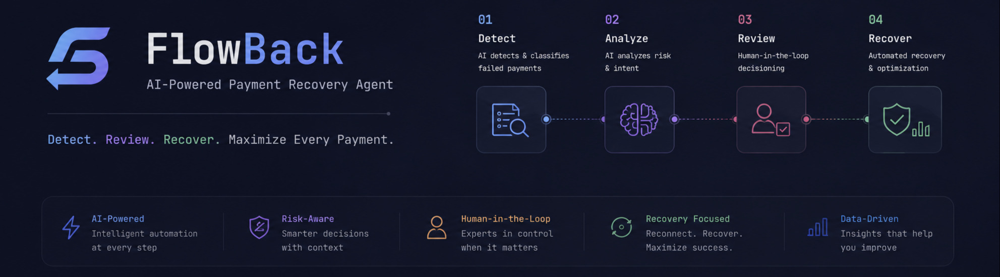
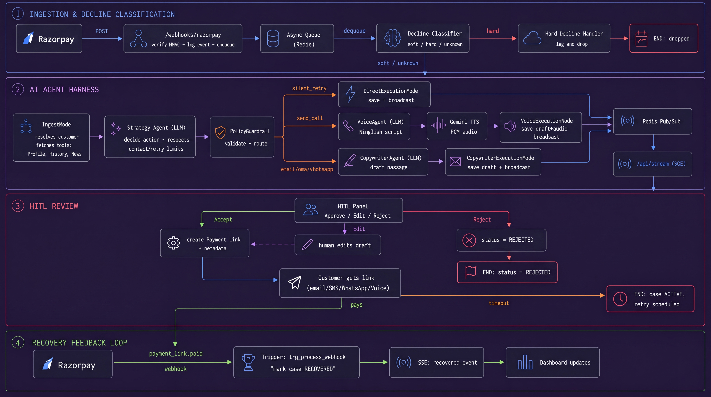

<div align="center">
  
</div>

<br/>

<div align="center">
  <p>
    
    
    
    
    
  </p>
</div>

---

## The Problem: Involuntary Churn

Between **7-12% of SaaS MRR** enters a failed payment state every billing cycle.
Most companies rely on static, rules-based dunning (e.g., "retry every 3 days"), which only recovers about ~30% of failures. 

To recover the remaining 70%, you need context:
- **Soft declines** (insufficient funds, technical errors) need smart, silent retries based on payday alignment.
- **Hard declines** (expired/blocked cards) require personalized, multi-channel outreach (Email, SMS, WhatsApp, Voice) to get the user to update their payment method.

## The Solution: Flowback

**Flowback** is an event-driven, AI-native platform that diagnoses payment failures in real-time, selects the optimal recovery strategy per customer, and drafts hyper-personalized outreach.

By marrying **agentic AI reasoning** with **strict deterministic guardrails** (idempotency, RBI compliance, contact-hour limits) and **Human-in-the-Loop (HITL)** reviews, Flowback brings fintech-grade engineering to AI revenue recovery.

---

## UI Glimpse (Human-in-the-Loop)

<details open>
<summary><b>Click to expand UI Previews</b></summary>
<br>

### Command Center
| Overview Dashboard | Workspace & HITL Review |
|:---:|:---:|
|  |  |
| *Real-time metrics, recovery trends, and AI success attribution.* | *Live webhook events streamed via SSE.* |

### AI Generative Previews (Human-in-the-Loop)
| Email Draft Preview | WhatsApp Message Preview |
|:---:|:---:|
|  |  |

| Voice Call (TTS) Preview | SMS Draft Preview |
|:---:|:---:|
|  |  |

</details>

---

## System Architecture

Flowback is built for scale, resilience, and auditability.



### Core Pipeline
1. **Webhook Ingestion**: Razorpay webhooks are verified (HMAC-SHA256) and immediately enqueued via Redis/Asynq to prevent data loss.
2. **Decline Classification**: Failures are deterministically classified. Soft declines bypass the AI for silent exponential backoff retries. Hard declines are routed to the Agent Harness.
3. **AI Strategy Harness**: The **Strategy Agent** (powered by LLMs) reads the enriched customer payload (profile, communication history, local news) and decides on the best action, delay, and discount strategy.
4. **Policy Guardrail**: Before any AI decision is executed, a deterministic guardrail intercepts it to enforce stopping rules (max 4 contacts), retry limits, and Indian Standard Time (IST) 8am-7pm contact windows.
5. **Generative Execution**: Actions are routed to specialized agents (e.g., the **Voice Agent** generating Hinglish call scripts via Gemini TTS, or the **Copywriter Agent** drafting emails).
6. **HITL & SSE**: Execution drafts are broadcasted in real-time via Redis Pub/Sub --> SSE to the React dashboard. A human reviews the AI's reasoning, edits if necessary, and clicks **Approve**, instantly generating and sending a Razorpay Payment Link.

---

## Key Features

- **Multi-Agent Orchestration**: Specialized LLM agents (Strategy, Copywriter, Voice) handle distinct parts of the recovery pipeline.
- **Fintech-Grade Safety**: AI hallucinates; money shouldn't. All agent decisions are routed through strict, deterministic policy engines.
- **Conversational Voice Recovery**: Integrates with Gemini TTS for automated, localized (Hinglish/English) voice calls to recover high-value accounts.
- **Event-Driven & Idempotent**: Full asynchronous queueing (Asynq) ensures no double-charges and guarantees exact-once processing.
- **Real-Time Observability**: See cases move through the state machine live on the dashboard via Server-Sent Events (SSE).
- **Revenue Attribution**: Accurately measures Agent-Recovered vs. Organically-Recovered revenue.

---

## Tech Stack

### Backend
- **Language**: Go (Golang) 1.22
- **Frameworks**: Gin (HTTP API), Google ADK (Agent Orchestration)
- **Database**: PostgreSQL 16 (SQLC + Goose migrations)
- **Queues/PubSub**: Redis 7, Asynq

### Frontend
- **Framework**: React 19, Vite 8, TypeScript
- **Styling**: Tailwind CSS v4, shadcn/ui
- **Data & State**: TanStack Query, Server-Sent Events (SSE)
- **Data Viz**: Nivo Charts

### Infrastructure
- **Deployment**: Docker, Docker Compose
- **Tracing**: Jaeger (OpenTelemetry)
- **Ingress**: Nginx, Cloudflare Tunnels (for webhook delivery)

---

## Quickstart

### Prerequisites
- Docker + Docker Compose v24+
- Razorpay Test Account
- Cloudflare Tunnel Token
- OpenRouter API Key & Google Gemini API Key

### 1. Clone & Configure
```bash
git clone https://github.com/dis70rt/flowback.git
cd flowback

cp .env.example .env
# Fill in your Razorpay, Cloudflare, and LLM API keys
```

### 2. Run the Stack
```bash
docker compose up -d --build
```
*Wait ~10 seconds for the Postgres healthcheck and auto-migrations to complete.*

### 3. Access Services
| Service | URL | Notes |
|---|---|---|
| **Dashboard** | `http://localhost:3000` | React frontend served by Nginx |
| **API** | `http://localhost:8080` | Go backend (also accessible at `/api`) |
| **Jaeger** | `http://localhost:16686` | Distributed traces |

### 4. Setup Webhooks
In your Razorpay Dashboard, add a webhook pointing to `https://<your-tunnel-url>/webhooks/razorpay`. Subscribe to:
- `subscription.pending`, `subscription.halted`
- `payment.failed`, `payment_link.paid`

---

## Deep Dives

- [Backend: Agent pipeline, DB schema, API routes, local dev](./apps/backend/README.md)
- [Frontend: React structure, SSE, production build](./apps/frontend/README.md)

---
<div align="center">
  <i>Built to win the battle against involuntary churn.</i>
</div>
