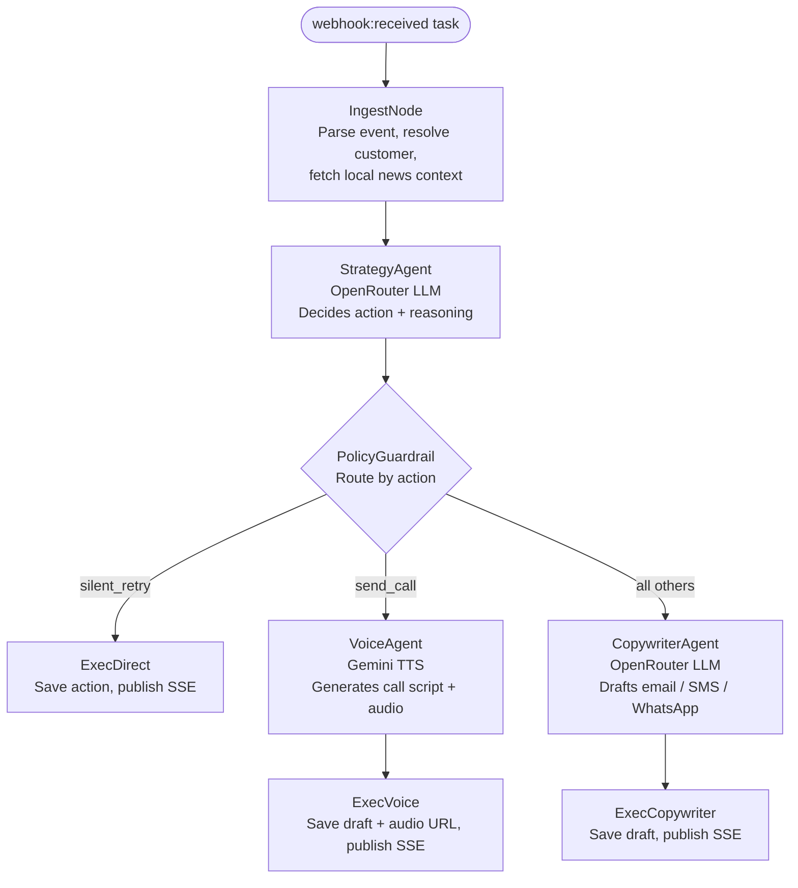

# Flowback Core API & Worker

The Go backend for the Flowback payment recovery platform.

Built for maximum throughput, absolute data integrity, and horizontal scalability. This is not a toy API for 5-6 users; it is an enterprise-grade event processor designed for SaaS businesses where **every single payment matters**.

---

## The Enterprise POV: Why This Architecture?

In revenue recovery, dropping a webhook or double-charging a customer is catastrophic. Most standard synchronous REST APIs fail under burst webhook traffic. We engineered Flowback to handle massive concurrency without breaking a sweat.

### 1. Zero Data Loss (Queue-Driven)
When Razorpay fires a webhook, our Gin API does exactly two things: verifies the HMAC-SHA256 signature and enqueues the payload into **Redis via Asynq**. It returns a `200 OK` in under 2ms. The actual heavy lifting (AI orchestration, DB writes, network calls) is handled asynchronously by horizontally scalable worker nodes. You can spin up 100 worker containers and they will consume the queue perfectly.

### 2. Idempotency & Concurrency Guarantees
Every webhook is processed with strict idempotency keys. If a worker crashes mid-task, Asynq automatically retries the task. Our SQLC/Postgres queries use strict transactional boundaries. A customer will never receive two identical AI recovery emails, and a failure event will never be processed twice.

### 3. Strict Deterministic Guardrails
AI models (LLMs) hallucinate; money shouldn't. The agent harness is strictly sandboxed. The Strategy Agent proposes an action, but before execution, it must pass through a **Policy Guardrail Node**. If the AI tries to contact a customer for the 5th time, or tries to call them outside of IST daytime hours, the guardrail hard-blocks the transaction.

---

## Agent Pipeline

Each incoming webhook task runs through the following node graph, built with Google ADK v2 `workflowagent`:



**Decline classification:** `soft_decline` retries silently, `hard_decline` escalates to a human, `unknown` falls back to the copywriter channel.

---

## Tech Stack

| Tool | Version | Purpose |
|---|---|---|
| Go | 1.22 | High-performance compiled language |
| Gin | v1 | HTTP router and middleware |
| SQLC | v2 | Type-safe SQL query generation |
| Goose | v3 | Database migrations (auto-run on startup) |
| Asynq | v0.x | Task queue backed by Redis |
| Google ADK | v2 | Agent orchestration and workflow graph |
| Redis | 7+ | Asynq task queue + Pub/Sub for SSE |
| PostgreSQL | 15+ | Primary datastore |
| OpenTelemetry | - | Distributed tracing, exported to Jaeger |

---

## Project Structure

```
cmd/
  api/        HTTP server entrypoint (Gin, port 8080)
  worker/     Asynq worker entrypoint (processes webhook:received tasks)
  seeder/     Interactive TUI for seeding development data

internal/
  agent/      Google ADK workflow, tools, guardrails, and agent definitions
  api/        Gin router, handlers, and SSE stream logic
  config/     Env-var loading via godotenv
  database/   DB connection init and Asynq client init
  events/     Asynq task enqueuing and payload types
  pubsub/     Redis Pub/Sub wrapper for SSE broadcasting
  razorpay/   Webhook signature verification and HTTP client
  repo/       SQLC-generated queries and types

migrations/   Goose SQL migration files (embedded in binary)
queries/      Raw .sql query files consumed by SQLC
```

---

## Local Development

### Prerequisites

- Go 1.22+
- PostgreSQL and Redis running locally, or via Docker:

```bash
docker compose up -d postgres redis
```

### Run API server

```bash
go run ./cmd/api
```
Starts on `http://localhost:8080`. Swagger UI available at `/api/docs`.

### Run Worker

```bash
go run ./cmd/worker
```
Listens for `webhook:received` tasks on Redis. Runs the full agent pipeline per task.

### Run Seeder TUI

```bash
go run ./cmd/seeder
```
Interactive terminal UI for inserting customers and synthetic payment events.

---

## Database

**Migrations:** Migrations are embedded in the binary using `go:embed` and run automatically on API startup via Goose. No manual step is needed in normal operation.

To run migrations manually:
```bash
goose -dir migrations postgres "$DATABASE_URL" up
```

To regenerate SQLC queries after editing any `.sql` file under `queries/`:
```bash
sqlc generate
```

---

## Webhook Setup

Configure the following in the Razorpay Dashboard under **Settings > Webhooks**.

**Webhook URL:** `https://<your-domain>/webhooks/razorpay`

**Events to subscribe:**
- `payment.failed`
- `subscription.pending`
- `subscription.halted`
- `payment_link.paid`

**Webhook Secret:** Set the secret in Razorpay and mirror it in `RAZORPAY_WEBHOOK_SECRET`. The handler verifies the `X-Razorpay-Signature` header on every request.

---

## Environment Variables

| Variable | Required | Description |
|---|---|---|
| `DATABASE_URL` | No | PostgreSQL connection string |
| `REDIS_ADDR` | No | Redis host:port (used for Asynq and Pub/Sub) |
| `RAZORPAY_WEBHOOK_SECRET` | Yes | Razorpay webhook signing secret |
| `RAZORPAY_KEY_ID` | Yes | Razorpay API key ID |
| `RAZORPAY_KEY_SECRET` | Yes | Razorpay API key secret |
| `OPENROUTER_API_KEY` | Yes | OpenRouter API key (strategy + copywriter agents) |
| `OTEL_EXPORTER_OTLP_ENDPOINT` | No | Jaeger / OTLP collector endpoint for tracing |

---

<details>
<summary><b>View API Routes</b></summary>
<br>

### Utility
| Method | Path | Description |
|---|---|---|
| `GET` | `/health` | Health check |
| `GET` | `/api/docs` | Swagger UI |
| `GET` | `/api/stream` | SSE stream for real-time dashboard updates |

### Webhooks
| Method | Path | Description |
|---|---|---|
| `POST` | `/webhooks/razorpay` | Receive Razorpay events, verify signature, enqueue task |

### Metrics
| Method | Path | Description |
|---|---|---|
| `GET` | `/api/metrics/overview` | High-level recovery summary |
| `GET` | `/api/metrics/trends` | Recovery trend data over time |
| `GET` | `/api/metrics/channels` | Breakdown by outreach channel |

### Cases
| Method | Path | Description |
|---|---|---|
| `GET` | `/api/cases` | List all recovery cases |
| `GET` | `/api/cases/:id` | Get a single recovery case |
| `POST` | `/api/cases/:id/approve` | Approve the pending draft action |
| `PUT` | `/api/cases/:id/draft` | Edit the pending draft before approval |
| `POST` | `/api/cases/:id/reject` | Reject the pending draft action |

### Customers
| Method | Path | Description |
|---|---|---|
| `GET` | `/api/customers` | List all customers |
| `GET` | `/api/customers/:id` | Get a single customer |
| `GET` | `/api/customers/:id/payments` | Get payment history for a customer |

</details>
