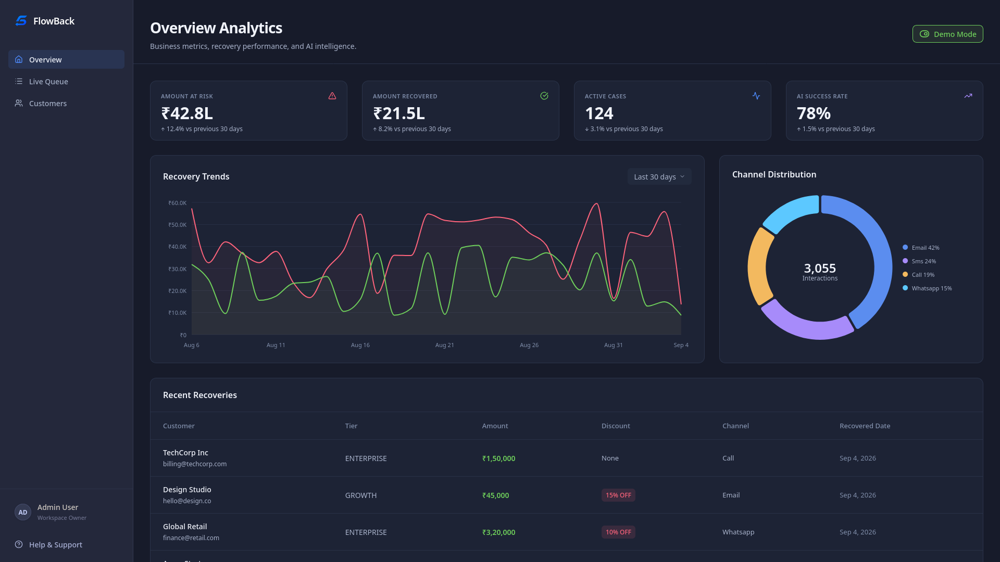
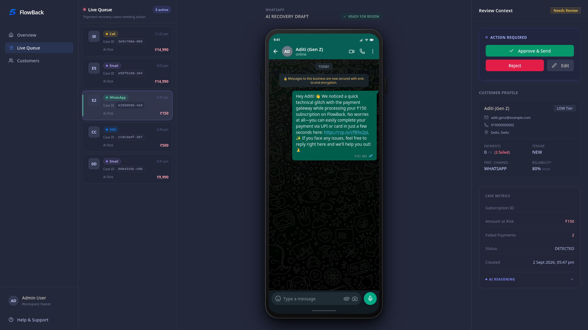
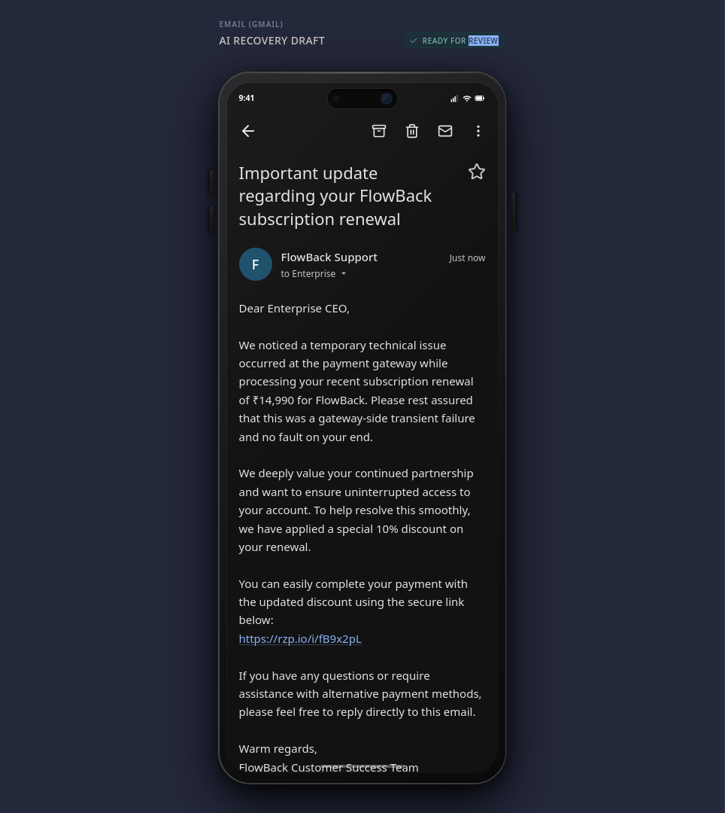
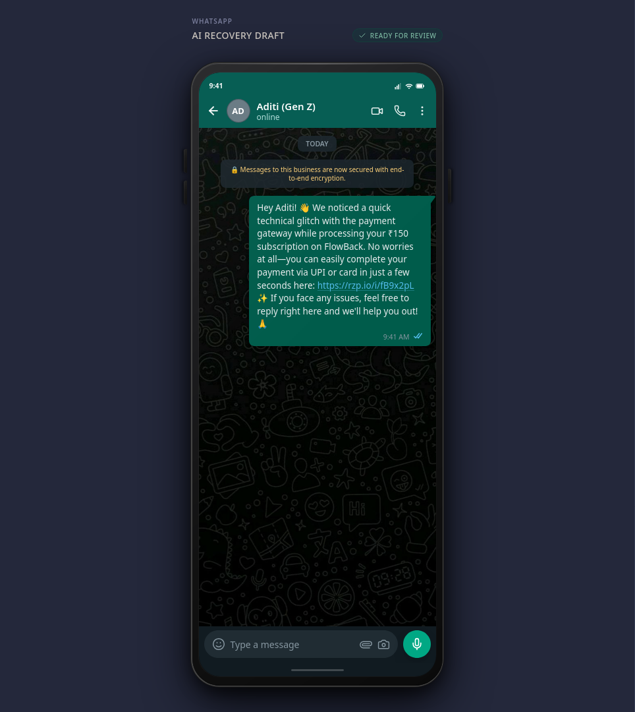
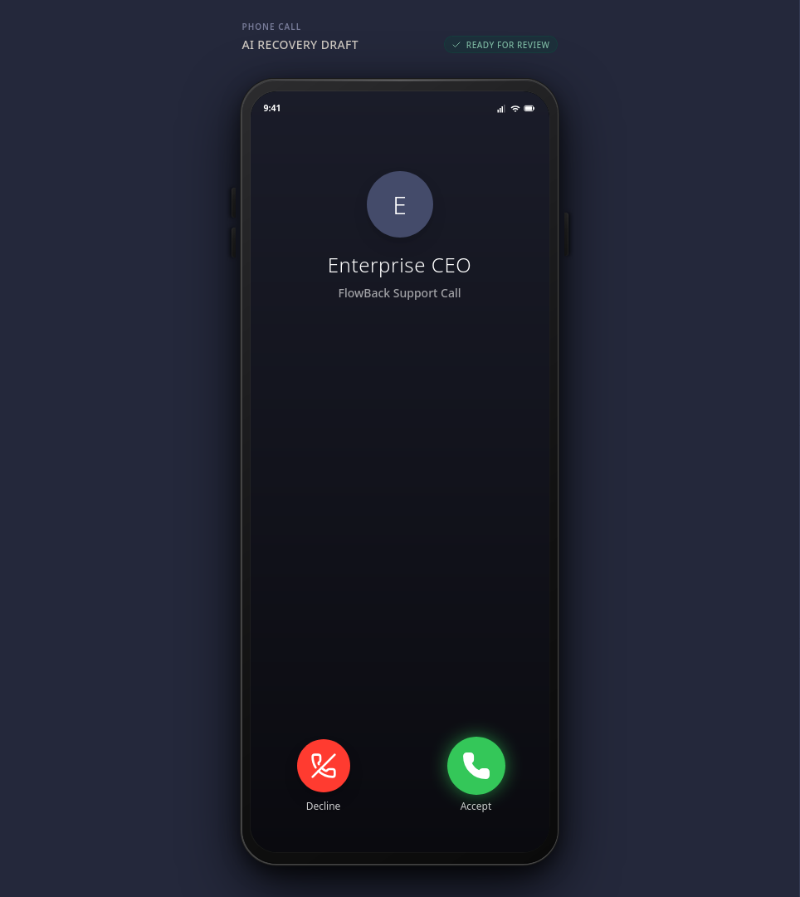
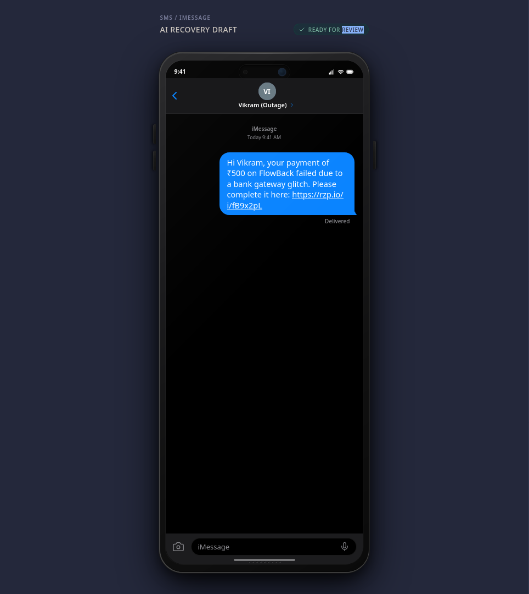

# Flowback Frontend

React dashboard for the Flowback payment recovery platform.

Built with a focus on **speed, real-time observability, and Human-in-the-Loop (HITL) safety**, this frontend serves as the command center for the AI agent harness.

---

## The Hackathon Perspective: Why This UI Matters

Most AI prototypes just output text. In fintech, text isn't enough—you need absolute confidence before executing an action that touches a customer. We designed this frontend to solve the "trust" problem in autonomous agents:

### 1. The Overview Dashboard
More than just a table, the dashboard is a real-time revenue attribution center. It tracks exactly how much revenue was saved organically vs. recovered by the AI agents, plotting recovery trends and channel success rates (Voice vs. SMS vs. WhatsApp) in live Nivo charts.

### 2. Human-in-the-Loop (HITL) Reviews
Before the AI executes any external communication, the case halts in the `Workspace`. The UI renders **pixel-perfect mockups** of what the customer will experience:
- **Email & SMS Previews**: Read the exact copy drafted by the Copywriter Agent on a simulated mobile screen.
- **WhatsApp Previews**: View the drafted message with interactive payment link buttons just as it will render in the WhatsApp UI.
- **Voice Call Previews**: Listen to the generated Hinglish/English `.wav` file that the Voice Agent intends to play over the phone.

*The human operator can Edit, Reject, or Approve the AI's plan with one click.*

### 3. Real-Time Reactivity (SSE)
We don't use long-polling. As Razorpay webhooks hit the Go backend, state changes are pushed instantly via Server-Sent Events (SSE) to the frontend. The `Workspace` UI updates live as cases transition from `pending` -> `ai_drafting` -> `awaiting_approval`.

---

<details open>
<summary><b>Click to expand UI Previews</b></summary>
<br>

### Command Center
| Overview Dashboard | Workspace & HITL Review |
|:---:|:---:|
|  |  |
| *Real-time metrics, recovery trends, and AI success attribution.* | *Live webhook events streamed via SSE.* |

### AI Generative Previews (Human-in-the-Loop)
| Email Draft Preview | WhatsApp Message Preview |
|:---:|:---:|
|  |  |

| Voice Call (TTS) Preview | SMS Draft Preview |
|:---:|:---:|
|  |  |

</details>

</details>

---

## Tech Stack

| Tool | Version | Purpose |
|---|---|---|
| React | 19 | UI framework |
| Vite | 8 | Dev server and bundler |
| TypeScript | 6 | Static typing |
| Tailwind CSS | 3.4 | Utility-first styling |
| TanStack Query | 5 | Server state and caching |
| React Router | 7 | Client-side routing |
| Nivo | 0.99 | Line and pie charts |
| shadcn/ui | 4 | Accessible UI primitives |
| Framer Motion | 13 | Animations and transitions |
| Axios | 1 | HTTP client |
| Sonner | 2 | Toast notifications |

---

## Local Development

### Prerequisites

- Node.js 20 or later
- Go backend running on `http://localhost:8080` (see `apps/backend/README.md`)

### Install dependencies

```bash
npm install
```

### Start the dev server

```bash
npm run dev
```

The Vite dev server starts on `http://localhost:5173`. All requests to `/api/*` are proxied to `http://localhost:8080` via the `server.proxy` setting in `vite.config.ts`. No CORS configuration is required.

---

## Production Build

### Build

```bash
npm run build
```

Output goes to `dist/`. The TypeScript compiler runs first (`tsc -b`), then Vite bundles the result. 

`cssMinify` is set to `false` in `vite.config.ts`. This is intentional. The default `lightningcss` minifier is incompatible with Tailwind's new `--spacing()` syntax. The build will still produce valid, unminified CSS.

### Docker

The image is built with a two-stage Dockerfile (`infrastructure/docker/Dockerfile.frontend`):

1. **Builder** -- `node:20-alpine` installs dependencies and runs `npm run build`.
2. **Server** -- `nginx:alpine` copies `dist/` to `/usr/share/nginx/html` and applies `infrastructure/docker/nginx.conf`.

Nginx serves the SPA with a `try_files` fallback for client-side routes. All `/api/*` requests are reverse-proxied to the `api` container at `http://api:8080/api/`. SSE-specific headers (`proxy_buffering off`, `proxy_read_timeout 24h`) are set on that location block so the stream stays open. No CORS configuration is needed in production because all traffic flows through the same Nginx origin.

---

## API Integration

All response types live in `src/api/types.ts`. They mirror the Go backend DTOs field-for-field, including nullable wrapper types (`NullString`, `NullInt64`, `NullTime`) that map directly to Go's `database/sql` null types.

All service functions live in `src/api/services.ts`. Each function calls a single endpoint and returns a typed promise. TanStack Query hooks in `src/hooks/useApi.ts` wrap these functions with caching and background refetch.

---

## Server-Sent Events (SSE)

The `useLiveActions` hook opens an SSE connection to `/api/stream` when the Workspace screen mounts. The backend pushes case state changes over this stream in real time. The hook wraps the connection in an `EventSource` and reconnects automatically on error. The `useUnifiedQueue` hook merges incoming SSE events with the existing TanStack Query cache so the UI stays consistent without a full refetch.

The Overview screen includes a demo toggle. When enabled, the dashboard renders hardcoded demo data instead of live API responses. This is useful for presentations when no backend is available.
